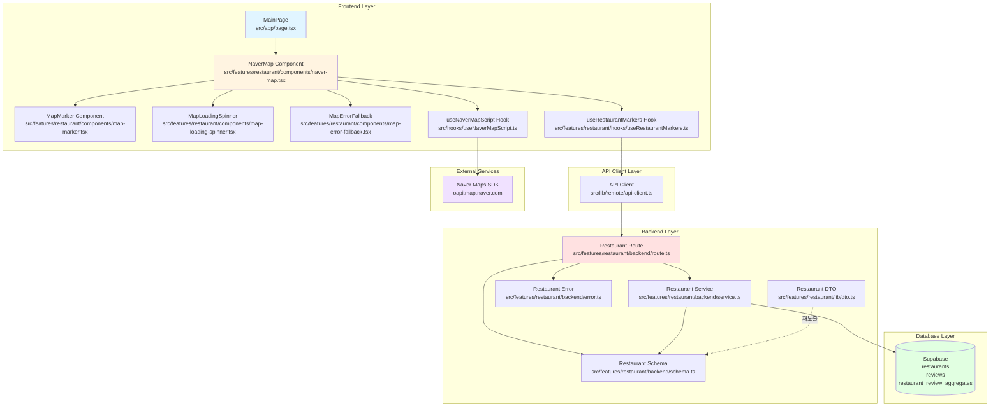

# Implementation Plan: UC-001 메인 페이지 초기 로드

## 개요

메인 페이지 초기 로드 기능을 구현하기 위한 모듈 설계 및 구현 계획입니다. 네이버 지도 SDK를 로드하고, 리뷰가 있는 음식점 마커를 표시하는 기능을 구현합니다.

### 모듈 목록

| 모듈 | 위치 | 설명 |
|------|------|------|
| **RestaurantMarker DTO** | `src/features/restaurant/lib/dto.ts` | 마커 데이터 타입 정의 (클라이언트 재노출) |
| **RestaurantMarker Schema** | `src/features/restaurant/backend/schema.ts` | 마커 API 요청/응답 스키마 (Zod) |
| **RestaurantMarker Service** | `src/features/restaurant/backend/service.ts` | 마커 데이터 조회 비즈니스 로직 |
| **RestaurantMarker Route** | `src/features/restaurant/backend/route.ts` | `GET /api/restaurants/markers` 엔드포인트 |
| **RestaurantMarker Error** | `src/features/restaurant/backend/error.ts` | 에러 코드 정의 |
| **useRestaurantMarkers Hook** | `src/features/restaurant/hooks/useRestaurantMarkers.ts` | React Query 훅 (마커 데이터 fetch) |
| **useNaverMapScript Hook** | `src/hooks/useNaverMapScript.ts` | 네이버 지도 SDK 로드 훅 (공통) |
| **NaverMap Component** | `src/features/restaurant/components/naver-map.tsx` | 지도 렌더링 컴포넌트 |
| **MapMarker Component** | `src/features/restaurant/components/map-marker.tsx` | 마커 생성 및 이벤트 관리 |
| **MapLoadingSpinner Component** | `src/features/restaurant/components/map-loading-spinner.tsx` | 지도 로딩 스피너 |
| **MapErrorFallback Component** | `src/features/restaurant/components/map-error-fallback.tsx` | 지도 로드 실패 폴백 UI |
| **MainPage** | `src/app/page.tsx` | 메인 페이지 (기존 파일 수정) |
| **Naver Map Types** | `src/types/naver-maps.d.ts` | 네이버 지도 SDK 타입 정의 |
| **Restaurant Migration** | `supabase/migrations/0002_create_restaurants_reviews_tables.sql` | restaurants, reviews 테이블 생성 |

---

## Diagram



---

## Implementation Plan

### 1. Database Layer

#### 1.1. Migration: `supabase/migrations/0002_create_restaurants_reviews_tables.sql`

**목적**: restaurants, reviews 테이블 및 restaurant_review_aggregates 뷰 생성

**구현 내용**:
```sql
-- pgcrypto 확장 활성화
CREATE EXTENSION IF NOT EXISTS "pgcrypto";

-- restaurants 테이블
CREATE TABLE IF NOT EXISTS public.restaurants (
  id uuid PRIMARY KEY DEFAULT gen_random_uuid(),
  name varchar(255) NOT NULL CHECK (char_length(btrim(name)) > 0),
  address text NOT NULL,
  category varchar(100),
  latitude numeric(10,7) NOT NULL CHECK (latitude BETWEEN -90 AND 90),
  longitude numeric(11,7) NOT NULL CHECK (longitude BETWEEN -180 AND 180),
  naver_place_id varchar(255) UNIQUE,
  created_at timestamptz NOT NULL DEFAULT now(),
  updated_at timestamptz NOT NULL DEFAULT now()
);

COMMENT ON TABLE public.restaurants IS '음식점 정보 테이블';

CREATE INDEX IF NOT EXISTS idx_restaurants_naver_place_id 
  ON public.restaurants(naver_place_id);
CREATE INDEX IF NOT EXISTS idx_restaurants_location 
  ON public.restaurants(latitude, longitude);

-- reviews 테이블
CREATE TABLE IF NOT EXISTS public.reviews (
  id uuid PRIMARY KEY DEFAULT gen_random_uuid(),
  restaurant_id uuid NOT NULL REFERENCES public.restaurants(id) ON DELETE CASCADE,
  author_name varchar(20) NOT NULL CHECK (char_length(btrim(author_name)) BETWEEN 1 AND 20),
  rating smallint NOT NULL CHECK (rating BETWEEN 1 AND 5),
  content text NOT NULL CHECK (char_length(btrim(content)) BETWEEN 10 AND 500),
  password_hash varchar(72) NOT NULL,
  created_at timestamptz NOT NULL DEFAULT now(),
  updated_at timestamptz NOT NULL DEFAULT now()
);

COMMENT ON TABLE public.reviews IS '음식점 리뷰 테이블';

CREATE INDEX IF NOT EXISTS idx_reviews_restaurant_created_at 
  ON public.reviews(restaurant_id, created_at DESC);

-- updated_at 트리거 함수
CREATE OR REPLACE FUNCTION touch_updated_at()
RETURNS TRIGGER AS $$
BEGIN
  NEW.updated_at = now();
  RETURN NEW;
END;
$$ LANGUAGE plpgsql;

-- restaurants updated_at 트리거
CREATE TRIGGER trg_restaurants_updated_at
BEFORE UPDATE ON public.restaurants
FOR EACH ROW EXECUTE FUNCTION touch_updated_at();

-- reviews updated_at 트리거
CREATE TRIGGER trg_reviews_updated_at
BEFORE UPDATE ON public.reviews
FOR EACH ROW EXECUTE FUNCTION touch_updated_at();

-- restaurant_review_aggregates 뷰
CREATE OR REPLACE VIEW public.restaurant_review_aggregates AS
SELECT
  r.id AS restaurant_id,
  COUNT(rv.id) AS review_count,
  CASE
    WHEN COUNT(rv.id) = 0 THEN NULL
    ELSE ROUND(AVG(rv.rating)::numeric, 1)
  END AS average_rating
FROM public.restaurants r
LEFT JOIN public.reviews rv ON rv.restaurant_id = r.id
GROUP BY r.id;

COMMENT ON VIEW public.restaurant_review_aggregates IS '음식점별 리뷰 통계 집계 뷰';

-- RLS 비활성화
ALTER TABLE IF EXISTS public.restaurants DISABLE ROW LEVEL SECURITY;
ALTER TABLE IF EXISTS public.reviews DISABLE ROW LEVEL SECURITY;
```

**검증 방법**:
- Supabase Dashboard SQL Editor에서 실행
- `SELECT * FROM restaurants LIMIT 1;` 실행하여 테이블 생성 확인
- `SELECT * FROM restaurant_review_aggregates LIMIT 1;` 실행하여 뷰 생성 확인

---

### 2. Backend Layer

#### 2.1. Error Codes: `src/features/restaurant/backend/error.ts`

**목적**: 음식점 관련 에러 코드 정의

**구현 내용**:
```typescript
export const restaurantErrorCodes = {
  notFound: 'RESTAURANT_NOT_FOUND',
  fetchError: 'RESTAURANT_FETCH_ERROR',
  validationError: 'RESTAURANT_VALIDATION_ERROR',
  markersFetchError: 'MARKERS_FETCH_ERROR',
} as const;

type RestaurantErrorValue = (typeof restaurantErrorCodes)[keyof typeof restaurantErrorCodes];

export type RestaurantServiceError = RestaurantErrorValue;
```

**Unit Test**:
```typescript
describe('restaurantErrorCodes', () => {
  it('should have all required error codes', () => {
    expect(restaurantErrorCodes.notFound).toBe('RESTAURANT_NOT_FOUND');
    expect(restaurantErrorCodes.fetchError).toBe('RESTAURANT_FETCH_ERROR');
    expect(restaurantErrorCodes.validationError).toBe('RESTAURANT_VALIDATION_ERROR');
    expect(restaurantErrorCodes.markersFetchError).toBe('MARKERS_FETCH_ERROR');
  });
});
```

---

#### 2.2. Schema: `src/features/restaurant/backend/schema.ts`

**목적**: 마커 API 요청/응답 스키마 정의

**구현 내용**:
```typescript
import { z } from 'zod';

export const RestaurantMarkerSchema = z.object({
  id: z.string().uuid(),
  name: z.string(),
  latitude: z.number(),
  longitude: z.number(),
  category: z.string().nullable(),
  averageRating: z.number().nullable(),
  reviewCount: z.number(),
});

export type RestaurantMarker = z.infer<typeof RestaurantMarkerSchema>;

export const RestaurantMarkersResponseSchema = z.array(RestaurantMarkerSchema);

export type RestaurantMarkersResponse = z.infer<typeof RestaurantMarkersResponseSchema>;

export const RestaurantMarkerRowSchema = z.object({
  id: z.string().uuid(),
  name: z.string(),
  latitude: z.string(),
  longitude: z.string(),
  category: z.string().nullable(),
  review_count: z.number(),
  average_rating: z.number().nullable(),
});

export type RestaurantMarkerRow = z.infer<typeof RestaurantMarkerRowSchema>;
```

**Unit Test**:
```typescript
describe('RestaurantMarkerSchema', () => {
  it('should validate valid marker data', () => {
    const validMarker = {
      id: '123e4567-e89b-12d3-a456-426614174000',
      name: '테스트 음식점',
      latitude: 37.5665,
      longitude: 126.9780,
      category: '한식',
      averageRating: 4.5,
      reviewCount: 10,
    };
    
    const result = RestaurantMarkerSchema.safeParse(validMarker);
    expect(result.success).toBe(true);
  });

  it('should reject invalid uuid', () => {
    const invalidMarker = {
      id: 'invalid-uuid',
      name: '테스트 음식점',
      latitude: 37.5665,
      longitude: 126.9780,
      category: '한식',
      averageRating: 4.5,
      reviewCount: 10,
    };
    
    const result = RestaurantMarkerSchema.safeParse(invalidMarker);
    expect(result.success).toBe(false);
  });
});
```

---

#### 2.3. Service: `src/features/restaurant/backend/service.ts`

**목적**: 마커 데이터 조회 비즈니스 로직

**구현 내용**:
```typescript
import type { SupabaseClient } from '@supabase/supabase-js';
import {
  failure,
  success,
  type HandlerResult,
} from '@/backend/http/response';
import {
  RestaurantMarkersResponseSchema,
  RestaurantMarkerRowSchema,
  type RestaurantMarkersResponse,
  type RestaurantMarkerRow,
} from '@/features/restaurant/backend/schema';
import {
  restaurantErrorCodes,
  type RestaurantServiceError,
} from '@/features/restaurant/backend/error';

export const getRestaurantMarkers = async (
  client: SupabaseClient,
): Promise<HandlerResult<RestaurantMarkersResponse, RestaurantServiceError, unknown>> => {
  const { data, error } = await client
    .from('restaurants')
    .select(`
      id,
      name,
      latitude,
      longitude,
      category,
      restaurant_review_aggregates!inner(review_count, average_rating)
    `)
    .gt('restaurant_review_aggregates.review_count', 0);

  if (error) {
    return failure(
      500,
      restaurantErrorCodes.markersFetchError,
      error.message,
    );
  }

  if (!data) {
    return success([]);
  }

  const markers = data
    .map((row: any) => {
      const rowParse = RestaurantMarkerRowSchema.safeParse({
        id: row.id,
        name: row.name,
        latitude: String(row.latitude),
        longitude: String(row.longitude),
        category: row.category,
        review_count: row.restaurant_review_aggregates?.review_count ?? 0,
        average_rating: row.restaurant_review_aggregates?.average_rating ?? null,
      });

      if (!rowParse.success) {
        return null;
      }

      return {
        id: rowParse.data.id,
        name: rowParse.data.name,
        latitude: parseFloat(rowParse.data.latitude),
        longitude: parseFloat(rowParse.data.longitude),
        category: rowParse.data.category,
        averageRating: rowParse.data.average_rating,
        reviewCount: rowParse.data.review_count,
      };
    })
    .filter((marker): marker is NonNullable<typeof marker> => marker !== null);

  const parsed = RestaurantMarkersResponseSchema.safeParse(markers);

  if (!parsed.success) {
    return failure(
      500,
      restaurantErrorCodes.validationError,
      'Markers payload failed validation.',
      parsed.error.format(),
    );
  }

  return success(parsed.data);
};
```

**Unit Test**:
```typescript
describe('getRestaurantMarkers', () => {
  it('should return markers with review count > 0', async () => {
    const mockClient = {
      from: jest.fn().mockReturnValue({
        select: jest.fn().mockReturnValue({
          gt: jest.fn().mockResolvedValue({
            data: [
              {
                id: '123e4567-e89b-12d3-a456-426614174000',
                name: '테스트 음식점',
                latitude: '37.5665',
                longitude: '126.9780',
                category: '한식',
                restaurant_review_aggregates: {
                  review_count: 5,
                  average_rating: 4.5,
                },
              },
            ],
            error: null,
          }),
        }),
      }),
    } as any;

    const result = await getRestaurantMarkers(mockClient);

    expect(result.ok).toBe(true);
    if (result.ok) {
      expect(result.data).toHaveLength(1);
      expect(result.data[0].name).toBe('테스트 음식점');
      expect(result.data[0].reviewCount).toBe(5);
    }
  });

  it('should return empty array when no restaurants with reviews', async () => {
    const mockClient = {
      from: jest.fn().mockReturnValue({
        select: jest.fn().mockReturnValue({
          gt: jest.fn().mockResolvedValue({
            data: [],
            error: null,
          }),
        }),
      }),
    } as any;

    const result = await getRestaurantMarkers(mockClient);

    expect(result.ok).toBe(true);
    if (result.ok) {
      expect(result.data).toEqual([]);
    }
  });

  it('should handle database error', async () => {
    const mockClient = {
      from: jest.fn().mockReturnValue({
        select: jest.fn().mockReturnValue({
          gt: jest.fn().mockResolvedValue({
            data: null,
            error: { message: 'Database error' },
          }),
        }),
      }),
    } as any;

    const result = await getRestaurantMarkers(mockClient);

    expect(result.ok).toBe(false);
    if (!result.ok) {
      expect(result.error.code).toBe('MARKERS_FETCH_ERROR');
    }
  });
});
```

---

#### 2.4. Route: `src/features/restaurant/backend/route.ts`

**목적**: `GET /api/restaurants/markers` 엔드포인트 정의

**구현 내용**:
```typescript
import type { Hono } from 'hono';
import { respond, type ErrorResult } from '@/backend/http/response';
import {
  getLogger,
  getSupabase,
  type AppEnv,
} from '@/backend/hono/context';
import { getRestaurantMarkers } from './service';
import {
  restaurantErrorCodes,
  type RestaurantServiceError,
} from './error';

export const registerRestaurantRoutes = (app: Hono<AppEnv>) => {
  app.get('/api/restaurants/markers', async (c) => {
    const supabase = getSupabase(c);
    const logger = getLogger(c);

    const result = await getRestaurantMarkers(supabase);

    if (!result.ok) {
      const errorResult = result as ErrorResult<RestaurantServiceError, unknown>;

      if (errorResult.error.code === restaurantErrorCodes.markersFetchError) {
        logger.error('Failed to fetch restaurant markers', errorResult.error.message);
      }

      return respond(c, result);
    }

    return respond(c, result);
  });
};
```

**Integration Test**:
```typescript
describe('GET /api/restaurants/markers', () => {
  it('should return 200 with markers array', async () => {
    const response = await fetch('/api/restaurants/markers');
    expect(response.status).toBe(200);
    
    const data = await response.json();
    expect(Array.isArray(data)).toBe(true);
  });

  it('should return empty array when no restaurants', async () => {
    // 테스트 DB에 데이터가 없는 경우
    const response = await fetch('/api/restaurants/markers');
    expect(response.status).toBe(200);
    
    const data = await response.json();
    expect(data).toEqual([]);
  });
});
```

---

#### 2.5. Hono App 라우터 등록: `src/backend/hono/app.ts`

**수정 내용**:
```typescript
// 기존 import에 추가
import { registerRestaurantRoutes } from "@/features/restaurant/backend/route";

// registerExampleRoutes(app); 다음 줄에 추가
registerRestaurantRoutes(app);
```

---

### 3. Frontend Layer

#### 3.1. DTO: `src/features/restaurant/lib/dto.ts`

**목적**: 백엔드 스키마를 클라이언트에서 재사용

**구현 내용**:
```typescript
export {
  RestaurantMarkerSchema,
  RestaurantMarkersResponseSchema,
  type RestaurantMarker,
  type RestaurantMarkersResponse,
} from '@/features/restaurant/backend/schema';
```

---

#### 3.2. React Query Hook: `src/features/restaurant/hooks/useRestaurantMarkers.ts`

**목적**: 마커 데이터 fetch 및 상태 관리

**구현 내용**:
```typescript
'use client';

import { useQuery } from '@tanstack/react-query';
import { apiClient, extractApiErrorMessage } from '@/lib/remote/api-client';
import { RestaurantMarkersResponseSchema } from '@/features/restaurant/lib/dto';

const fetchRestaurantMarkers = async () => {
  try {
    const { data } = await apiClient.get('/api/restaurants/markers');
    return RestaurantMarkersResponseSchema.parse(data);
  } catch (error) {
    const message = extractApiErrorMessage(
      error,
      'Failed to fetch restaurant markers.',
    );
    throw new Error(message);
  }
};

export const useRestaurantMarkers = () =>
  useQuery({
    queryKey: ['restaurantMarkers'],
    queryFn: fetchRestaurantMarkers,
    staleTime: 5 * 60 * 1000, // 5분
    retry: 3,
    retryDelay: (attemptIndex) => Math.min(1000 * 2 ** attemptIndex, 30000),
  });
```

**QA Sheet**:
| 테스트 케이스 | 입력 | 예상 결과 | 실제 결과 | 상태 |
|--------------|------|-----------|-----------|------|
| 정상 데이터 로드 | API 정상 응답 | 마커 배열 반환 | - | ⬜ |
| 빈 배열 응답 | API 빈 배열 반환 | 빈 배열 반환 | - | ⬜ |
| 네트워크 에러 | API 호출 실패 | 에러 메시지 표시 | - | ⬜ |
| 재시도 로직 | API 타임아웃 | 최대 3회 재시도 | - | ⬜ |
| 캐싱 동작 | 5분 이내 재호출 | 캐시된 데이터 사용 | - | ⬜ |

---

#### 3.3. Naver Map Script Hook: `src/hooks/useNaverMapScript.ts`

**목적**: 네이버 지도 SDK 스크립트 로드 및 상태 관리 (공통 훅)

**구현 내용**:
```typescript
'use client';

import { useEffect, useState } from 'react';

type ScriptStatus = 'idle' | 'loading' | 'ready' | 'error';

const MAX_RETRIES = 3;
const RETRY_DELAY = 2000;

export const useNaverMapScript = () => {
  const [status, setStatus] = useState<ScriptStatus>('idle');
  const [retryCount, setRetryCount] = useState(0);

  useEffect(() => {
    if (typeof window === 'undefined') return;

    if (window.naver?.maps) {
      setStatus('ready');
      return;
    }

    const clientId = process.env.NEXT_PUBLIC_NAVER_MAPS_CLIENT_ID;

    if (!clientId) {
      console.error('NEXT_PUBLIC_NAVER_MAPS_CLIENT_ID is not defined');
      setStatus('error');
      return;
    }

    const loadScript = () => {
      setStatus('loading');

      const script = document.createElement('script');
      script.src = `https://oapi.map.naver.com/openapi/v3/maps.js?ncpClientId=${clientId}`;
      script.async = true;

      script.onload = () => {
        if (window.naver?.maps) {
          setStatus('ready');
          setRetryCount(0);
        } else {
          handleError();
        }
      };

      script.onerror = () => {
        handleError();
      };

      document.head.appendChild(script);

      return () => {
        document.head.removeChild(script);
      };
    };

    const handleError = () => {
      if (retryCount < MAX_RETRIES) {
        setTimeout(() => {
          setRetryCount((prev) => prev + 1);
        }, RETRY_DELAY);
      } else {
        setStatus('error');
      }
    };

    if (retryCount > 0 && retryCount <= MAX_RETRIES) {
      loadScript();
    } else if (status === 'idle') {
      loadScript();
    }
  }, [retryCount, status]);

  const retry = () => {
    setStatus('idle');
    setRetryCount(0);
  };

  return {
    isLoading: status === 'loading',
    isReady: status === 'ready',
    isError: status === 'error',
    retry,
  };
};
```

**QA Sheet**:
| 테스트 케이스 | 입력 | 예상 결과 | 실제 결과 | 상태 |
|--------------|------|-----------|-----------|------|
| 정상 스크립트 로드 | 유효한 Client ID | isReady = true | - | ⬜ |
| Client ID 누락 | 환경변수 없음 | isError = true | - | ⬜ |
| 스크립트 로드 실패 | 네트워크 에러 | 3회 재시도 후 isError | - | ⬜ |
| 재시도 성공 | 2번째 시도 성공 | isReady = true | - | ⬜ |
| 수동 재시도 | retry() 호출 | 상태 초기화 및 재로드 | - | ⬜ |
| 이미 로드된 경우 | window.naver.maps 존재 | 즉시 isReady = true | - | ⬜ |

---

#### 3.4. Type Definition: `src/types/naver-maps.d.ts`

**목적**: 네이버 지도 SDK 타입 정의

**구현 내용**:
```typescript
declare global {
  interface Window {
    naver?: {
      maps: {
        LatLng: new (lat: number, lng: number) => NaverLatLng;
        Map: new (element: HTMLElement, options: NaverMapOptions) => NaverMap;
        Marker: new (options: NaverMarkerOptions) => NaverMarker;
        Event: {
          addListener: (
            target: any,
            eventName: string,
            handler: (...args: any[]) => void
          ) => NaverEventListener;
          removeListener: (listener: NaverEventListener) => void;
        };
      };
    };
  }
}

export interface NaverLatLng {
  lat: () => number;
  lng: () => number;
}

export interface NaverMapOptions {
  center: NaverLatLng;
  zoom?: number;
  zoomControl?: boolean;
  zoomControlOptions?: {
    position?: number;
  };
}

export interface NaverMap {
  setCenter: (latlng: NaverLatLng) => void;
  setZoom: (level: number) => void;
  getCenter: () => NaverLatLng;
  getZoom: () => number;
}

export interface NaverMarkerOptions {
  position: NaverLatLng;
  map: NaverMap;
  title?: string;
  icon?: {
    content?: string;
    size?: { width: number; height: number };
    anchor?: { x: number; y: number };
  };
}

export interface NaverMarker {
  setMap: (map: NaverMap | null) => void;
  getPosition: () => NaverLatLng;
  setPosition: (latlng: NaverLatLng) => void;
}

export interface NaverEventListener {
  remove: () => void;
}

export {};
```

---

#### 3.5. MapLoadingSpinner Component: `src/features/restaurant/components/map-loading-spinner.tsx`

**목적**: 지도 로딩 중 스피너 표시

**구현 내용**:
```typescript
'use client';

import { Loader2 } from 'lucide-react';

export const MapLoadingSpinner = () => {
  return (
    <div className="flex h-full w-full items-center justify-center bg-slate-100">
      <div className="flex flex-col items-center gap-3">
        <Loader2 className="h-8 w-8 animate-spin text-slate-600" />
        <p className="text-sm text-slate-600">지도를 불러오는 중...</p>
      </div>
    </div>
  );
};
```

**QA Sheet**:
| 테스트 케이스 | 입력 | 예상 결과 | 실제 결과 | 상태 |
|--------------|------|-----------|-----------|------|
| 렌더링 확인 | 컴포넌트 마운트 | 스피너 및 텍스트 표시 | - | ⬜ |
| 스타일 확인 | - | 중앙 정렬, 회전 애니메이션 | - | ⬜ |

---

#### 3.6. MapErrorFallback Component: `src/features/restaurant/components/map-error-fallback.tsx`

**목적**: 지도 로드 실패 시 폴백 UI

**구현 내용**:
```typescript
'use client';

import { AlertCircle } from 'lucide-react';
import { Button } from '@/components/ui/button';

type MapErrorFallbackProps = {
  onRetry: () => void;
};

export const MapErrorFallback = ({ onRetry }: MapErrorFallbackProps) => {
  return (
    <div className="flex h-full w-full items-center justify-center bg-slate-100">
      <div className="flex max-w-md flex-col items-center gap-4 p-6 text-center">
        <AlertCircle className="h-12 w-12 text-red-500" />
        <div className="space-y-2">
          <h3 className="text-lg font-semibold text-slate-900">
            지도를 불러올 수 없습니다
          </h3>
          <p className="text-sm text-slate-600">
            네이버 지도 SDK를 로드하는 중 문제가 발생했습니다.
            <br />
            네트워크 연결을 확인하고 다시 시도해주세요.
          </p>
        </div>
        <Button onClick={onRetry} variant="default">
          다시 시도
        </Button>
      </div>
    </div>
  );
};
```

**QA Sheet**:
| 테스트 케이스 | 입력 | 예상 결과 | 실제 결과 | 상태 |
|--------------|------|-----------|-----------|------|
| 렌더링 확인 | 컴포넌트 마운트 | 에러 메시지 및 버튼 표시 | - | ⬜ |
| 재시도 버튼 클릭 | 버튼 클릭 | onRetry 콜백 호출 | - | ⬜ |

---

#### 3.7. MapMarker Component: `src/features/restaurant/components/map-marker.tsx`

**목적**: 개별 마커 생성 및 이벤트 관리

**구현 내용**:
```typescript
'use client';

import { useEffect, useRef } from 'react';
import type { NaverMap, NaverMarker } from '@/types/naver-maps';
import type { RestaurantMarker } from '@/features/restaurant/lib/dto';

type MapMarkerProps = {
  map: NaverMap;
  marker: RestaurantMarker;
  onMarkerClick?: (marker: RestaurantMarker) => void;
  onMarkerHover?: (marker: RestaurantMarker) => void;
  onMarkerLeave?: () => void;
};

export const MapMarker = ({
  map,
  marker,
  onMarkerClick,
  onMarkerHover,
  onMarkerLeave,
}: MapMarkerProps) => {
  const markerRef = useRef<NaverMarker | null>(null);

  useEffect(() => {
    if (!window.naver?.maps || !map) return;

    const position = new window.naver.maps.LatLng(
      marker.latitude,
      marker.longitude,
    );

    const naverMarker = new window.naver.maps.Marker({
      position,
      map,
      title: marker.name,
    });

    markerRef.current = naverMarker;

    const clickListener = window.naver.maps.Event.addListener(
      naverMarker,
      'click',
      () => {
        onMarkerClick?.(marker);
      },
    );

    const mouseoverListener = window.naver.maps.Event.addListener(
      naverMarker,
      'mouseover',
      () => {
        onMarkerHover?.(marker);
      },
    );

    const mouseoutListener = window.naver.maps.Event.addListener(
      naverMarker,
      'mouseout',
      () => {
        onMarkerLeave?.();
      },
    );

    return () => {
      window.naver.maps.Event.removeListener(clickListener);
      window.naver.maps.Event.removeListener(mouseoverListener);
      window.naver.maps.Event.removeListener(mouseoutListener);
      naverMarker.setMap(null);
    };
  }, [map, marker, onMarkerClick, onMarkerHover, onMarkerLeave]);

  return null;
};
```

**QA Sheet**:
| 테스트 케이스 | 입력 | 예상 결과 | 실제 결과 | 상태 |
|--------------|------|-----------|-----------|------|
| 마커 생성 | 유효한 marker 데이터 | 지도에 마커 표시 | - | ⬜ |
| 클릭 이벤트 | 마커 클릭 | onMarkerClick 호출 | - | ⬜ |
| 호버 이벤트 | 마커 호버 | onMarkerHover 호출 | - | ⬜ |
| 호버 해제 이벤트 | 마커에서 마우스 이동 | onMarkerLeave 호출 | - | ⬜ |
| 언마운트 정리 | 컴포넌트 언마운트 | 이벤트 리스너 제거, 마커 제거 | - | ⬜ |
| 좌표 누락 처리 | latitude/longitude 없음 | 마커 생성 스킵 | - | ⬜ |

---

#### 3.8. NaverMap Component: `src/features/restaurant/components/naver-map.tsx`

**목적**: 지도 렌더링 및 마커 관리 메인 컴포넌트

**구현 내용**:
```typescript
'use client';

import { useEffect, useRef, useState } from 'react';
import { useNaverMapScript } from '@/hooks/useNaverMapScript';
import { useRestaurantMarkers } from '@/features/restaurant/hooks/useRestaurantMarkers';
import { MapLoadingSpinner } from './map-loading-spinner';
import { MapErrorFallback } from './map-error-fallback';
import { MapMarker } from './map-marker';
import type { NaverMap as NaverMapType } from '@/types/naver-maps';
import type { RestaurantMarker } from '@/features/restaurant/lib/dto';

const DEFAULT_CENTER = {
  lat: 37.5665,
  lng: 126.9780,
};

const DEFAULT_ZOOM = 13;

type NaverMapProps = {
  onMarkerClick?: (marker: RestaurantMarker) => void;
  onMarkerHover?: (marker: RestaurantMarker) => void;
  onMarkerLeave?: () => void;
};

export const NaverMap = ({
  onMarkerClick,
  onMarkerHover,
  onMarkerLeave,
}: NaverMapProps) => {
  const mapRef = useRef<HTMLDivElement>(null);
  const [map, setMap] = useState<NaverMapType | null>(null);

  const { isLoading: isScriptLoading, isReady: isScriptReady, isError: isScriptError, retry } = useNaverMapScript();
  const { data: markers, isLoading: isMarkersLoading, isError: isMarkersError } = useRestaurantMarkers();

  useEffect(() => {
    if (!isScriptReady || !mapRef.current || map) return;

    const center = new window.naver.maps.LatLng(
      DEFAULT_CENTER.lat,
      DEFAULT_CENTER.lng,
    );

    const mapInstance = new window.naver.maps.Map(mapRef.current, {
      center,
      zoom: DEFAULT_ZOOM,
      zoomControl: true,
    });

    setMap(mapInstance);
  }, [isScriptReady, map]);

  if (isScriptLoading || isMarkersLoading) {
    return <MapLoadingSpinner />;
  }

  if (isScriptError) {
    return <MapErrorFallback onRetry={retry} />;
  }

  if (isMarkersError) {
    return (
      <div className="flex h-full w-full items-center justify-center bg-slate-100">
        <p className="text-sm text-slate-600">
          마커 데이터를 불러오는 중 문제가 발생했습니다.
        </p>
      </div>
    );
  }

  return (
    <div className="relative h-full w-full">
      <div ref={mapRef} className="h-full w-full" />
      {map &&
        markers?.map((marker) => (
          <MapMarker
            key={marker.id}
            map={map}
            marker={marker}
            onMarkerClick={onMarkerClick}
            onMarkerHover={onMarkerHover}
            onMarkerLeave={onMarkerLeave}
          />
        ))}
    </div>
  );
};
```

**QA Sheet**:
| 테스트 케이스 | 입력 | 예상 결과 | 실제 결과 | 상태 |
|--------------|------|-----------|-----------|------|
| 정상 렌더링 | 스크립트 로드 성공, 마커 데이터 있음 | 지도 및 마커 표시 | - | ⬜ |
| 스크립트 로딩 중 | isScriptLoading = true | 로딩 스피너 표시 | - | ⬜ |
| 마커 로딩 중 | isMarkersLoading = true | 로딩 스피너 표시 | - | ⬜ |
| 스크립트 로드 실패 | isScriptError = true | 에러 폴백 UI 표시 | - | ⬜ |
| 마커 로드 실패 | isMarkersError = true | 에러 메시지 표시 | - | ⬜ |
| 마커 없음 | markers = [] | 지도만 표시 (마커 없음) | - | ⬜ |
| 기본 중심 좌표 | - | 서울 시청 중심 (37.5665, 126.9780) | - | ⬜ |
| 기본 줌 레벨 | - | 줌 레벨 13 | - | ⬜ |

---

#### 3.9. MainPage Update: `src/app/page.tsx`

**목적**: 기존 메인 페이지를 지도 중심으로 변경

**구현 내용**:
```typescript
'use client';

import { NaverMap } from '@/features/restaurant/components/naver-map';
import type { RestaurantMarker } from '@/features/restaurant/lib/dto';

export default function Home() {
  const handleMarkerClick = (marker: RestaurantMarker) => {
    console.log('Marker clicked:', marker);
    // TODO: UC-005 구현 시 음식점 상세 페이지로 이동
  };

  const handleMarkerHover = (marker: RestaurantMarker) => {
    console.log('Marker hovered:', marker);
    // TODO: UC-004 구현 시 툴팁 표시
  };

  const handleMarkerLeave = () => {
    console.log('Marker leave');
    // TODO: UC-004 구현 시 툴팁 숨김
  };

  return (
    <main className="h-screen w-screen">
      <NaverMap
        onMarkerClick={handleMarkerClick}
        onMarkerHover={handleMarkerHover}
        onMarkerLeave={handleMarkerLeave}
      />
    </main>
  );
}
```

**QA Sheet**:
| 테스트 케이스 | 입력 | 예상 결과 | 실제 결과 | 상태 |
|--------------|------|-----------|-----------|------|
| 페이지 렌더링 | / 접속 | 전체 화면 지도 표시 | - | ⬜ |
| 마커 클릭 | 마커 클릭 | 콘솔 로그 출력 | - | ⬜ |
| 마커 호버 | 마커 호버 | 콘솔 로그 출력 | - | ⬜ |
| 반응형 확인 | 모바일, 태블릿, 데스크톱 | 각 화면 크기에 맞게 표시 | - | ⬜ |

---

### 4. Environment Variables

#### 4.1. `.env.local` 추가

**필수 환경 변수**:
```env
# Naver Maps SDK (클라이언트)
NEXT_PUBLIC_NAVER_MAPS_CLIENT_ID=발급받은_Client_ID

# Supabase (기존)
SUPABASE_URL=your_supabase_url
SUPABASE_SERVICE_ROLE_KEY=your_service_role_key
```

**환경 변수 발급 방법**:
1. Naver Cloud Platform Console 접속
2. Services → Application Services → Maps → Application
3. Application 등록 → Maps (Web Dynamic Map) 선택
4. 서비스 환경 등록 (http://localhost:3000)
5. Client ID 발급 받아 환경 변수에 추가

---

## 구현 순서 및 충돌 검증

### Phase 1: Database Layer
1. ✅ Migration 파일 작성 (`0002_create_restaurants_reviews_tables.sql`)
2. ✅ Supabase Dashboard에서 migration 실행
3. ✅ 테이블 및 뷰 생성 확인

**충돌 검증**: 
- `0001_create_example_table.sql`과 테이블명 충돌 없음
- 기존 스키마에 영향 없음

---

### Phase 2: Backend Layer
1. ✅ Error codes 정의 (`restaurant/backend/error.ts`)
2. ✅ Schema 정의 (`restaurant/backend/schema.ts`)
3. ✅ Service 구현 (`restaurant/backend/service.ts`)
4. ✅ Route 구현 (`restaurant/backend/route.ts`)
5. ✅ Hono app에 라우터 등록 (`backend/hono/app.ts` 수정)

**충돌 검증**:
- `example` feature와 동일한 구조 사용 → 패턴 일관성 유지
- 새로운 라우트 `/api/restaurants/markers` 추가 → 기존 라우트와 충돌 없음
- `success`, `failure`, `respond` 헬퍼 재사용 → DRY 원칙 준수

---

### Phase 3: Frontend Layer (Shared)
1. ✅ Naver Maps 타입 정의 (`types/naver-maps.d.ts`)
2. ✅ useNaverMapScript 훅 구현 (`hooks/useNaverMapScript.ts`)

**충돌 검증**:
- 공통 훅으로 분리하여 다른 feature에서도 재사용 가능
- 기존 훅과 충돌 없음

---

### Phase 4: Frontend Layer (Feature)
1. ✅ DTO 재노출 (`restaurant/lib/dto.ts`)
2. ✅ useRestaurantMarkers 훅 구현 (`restaurant/hooks/useRestaurantMarkers.ts`)
3. ✅ MapLoadingSpinner 컴포넌트 (`restaurant/components/map-loading-spinner.tsx`)
4. ✅ MapErrorFallback 컴포넌트 (`restaurant/components/map-error-fallback.tsx`)
5. ✅ MapMarker 컴포넌트 (`restaurant/components/map-marker.tsx`)
6. ✅ NaverMap 컴포넌트 (`restaurant/components/naver-map.tsx`)

**충돌 검증**:
- `example` feature와 동일한 구조 (`lib/dto.ts`, `hooks/`, `components/`) → 패턴 일관성 유지
- React Query 사용 패턴 동일 → 기존 코드와 일관성 유지
- `apiClient` 재사용 → DRY 원칙 준수

---

### Phase 5: Main Page Integration
1. ✅ 기존 `src/app/page.tsx` 백업
2. ✅ 새로운 메인 페이지 구현 (지도 중심)

**충돌 검증**:
- 기존 페이지 완전 교체 → 충돌 없음
- Client Component로 유지 → 프로젝트 규칙 준수

---

### Phase 6: Environment Setup
1. ✅ `.env.local`에 `NEXT_PUBLIC_NAVER_MAPS_CLIENT_ID` 추가
2. ✅ Naver Cloud Platform에서 Client ID 발급

**충돌 검증**:
- 기존 환경 변수에 영향 없음
- `NEXT_PUBLIC_` 접두사 사용으로 클라이언트 노출 허용

---

## 테스트 전략

### Unit Tests
- Backend Service 로직 (`getRestaurantMarkers`)
- Schema 검증 (`RestaurantMarkerSchema`)
- Error codes 정의

### Integration Tests
- API 엔드포인트 (`GET /api/restaurants/markers`)
- React Query 훅 (`useRestaurantMarkers`)

### E2E Tests (Manual QA)
- 메인 페이지 로드
- 지도 SDK 로드 및 초기화
- 마커 표시 및 이벤트
- 에러 핸들링 (SDK 로드 실패, API 실패)

---

## 성능 고려사항

1. **React Query 캐싱**: 마커 데이터 5분 캐싱으로 불필요한 API 호출 감소
2. **재시도 로직**: 지수 백오프로 네트워크 부하 최소화
3. **마커 렌더링 최적화**: 각 마커를 개별 컴포넌트로 분리하여 재렌더링 최소화
4. **스크립트 로드 최적화**: SDK 중복 로드 방지

---

## 보안 고려사항

1. **환경 변수 관리**: 
   - Naver Maps Client ID는 도메인 제한으로 보호됨 (`NEXT_PUBLIC_` 사용 가능)
   - Supabase Service Role Key는 서버 전용 (클라이언트 노출 금지)

2. **API 보안**:
   - Supabase RLS 비활성화 (요구사항)
   - 서버 측 데이터 검증 (Zod 스키마)

---

## 향후 확장 고려사항

1. **마커 클러스터링**: 대량 마커 처리 시 성능 개선
2. **마커 커스터마이징**: 평점별 마커 색상/아이콘 변경
3. **지도 상태 관리**: 줌 레벨, 중심 좌표를 URL 쿼리 파라미터로 관리
4. **현재 위치 기능**: Geolocation API 연동
5. **마커 툴팁**: UC-004 구현 시 추가

---

## 완료 체크리스트

- [ ] Database migration 실행 및 검증
- [ ] Backend 모듈 구현 및 단위 테스트
- [ ] Frontend 공통 훅 구현 및 테스트
- [ ] Frontend feature 모듈 구현 및 QA
- [ ] 메인 페이지 통합 및 E2E 테스트
- [ ] 환경 변수 설정 및 문서화
- [ ] 에러 핸들링 시나리오 검증
- [ ] 성능 테스트 (마커 100개 이상)
- [ ] 반응형 디자인 검증 (모바일, 태블릿, 데스크톱)
- [ ] 코드 리뷰 및 린트 통과

