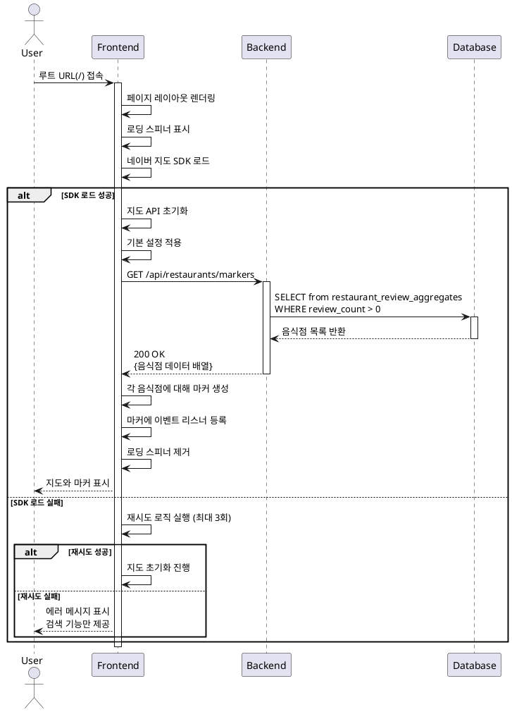

# UC-001: 메인 페이지 초기 로드

## Primary Actor
일반 사용자 (맛집을 찾고자 하는 방문자)

## Precondition
- 사용자가 웹 브라우저를 통해 인터넷에 접속 가능한 상태
- 네이버 지도 SDK와 백엔드 API 서버가 정상 작동 중

## Trigger
사용자가 루트 URL(`/`)에 접속

## Main Scenario

1. 사용자가 웹 브라우저에서 플랫폼의 루트 URL에 접속한다.
2. 시스템은 메인 페이지 레이아웃을 렌더링하고 로딩 스피너를 표시한다.
3. 시스템은 네이버 지도 SDK 스크립트를 로드한다.
4. 시스템은 지도 API를 초기화하고 기본 설정(중심 좌표, 줌 레벨)을 적용한다.
5. 시스템은 백엔드 API(`GET /api/restaurants/markers`)를 호출하여 리뷰가 존재하는 음식점 목록을 조회한다.
6. 시스템은 응답받은 각 음식점 데이터를 기반으로 지도에 마커를 생성한다.
7. 시스템은 각 마커에 클릭 및 호버 이벤트 리스너를 등록한다.
8. 시스템은 로딩 스피너를 제거하고 완성된 지도를 표시한다.
9. 사용자는 네이버 지도와 리뷰가 있는 음식점 마커들을 확인할 수 있다.
10. 사용자는 상단 검색창을 통해 음식점을 검색하거나 지도를 자유롭게 조작할 수 있다.

## Edge Cases

### EC-001: 네이버 지도 SDK 로드 실패
- **상황**: 네이버 지도 SDK 스크립트 로드가 실패함
- **처리**: 
  - 시스템은 최대 3회까지 2초 간격으로 재시도한다.
  - 모든 재시도가 실패하면 지도 영역에 에러 메시지를 표시한다.
  - 검색 기능은 유지하여 사용자가 음식점을 검색할 수 있도록 한다.
  - 재시도 버튼을 제공하여 사용자가 수동으로 재로드를 시도할 수 있게 한다.

### EC-002: 마커 데이터 조회 실패
- **상황**: 백엔드 API 호출이 네트워크 에러 또는 서버 에러로 실패함
- **처리**:
  - 시스템은 빈 배열로 처리하여 지도만 표시한다.
  - 에러 토스트 메시지를 표시하고 재시도 버튼을 제공한다.
  - 에러 내용을 로깅하여 모니터링 시스템에 전송한다.

### EC-003: 좌표 데이터 누락
- **상황**: 응답받은 음식점 데이터 중 일부가 위도 또는 경도 정보를 포함하지 않음
- **처리**:
  - 시스템은 해당 음식점의 마커 생성을 건너뛴다.
  - 유효한 좌표를 가진 음식점만 마커로 표시한다.
  - 에러 내용을 로깅하여 데이터 품질 개선에 활용한다.

### EC-004: 리뷰가 있는 음식점이 없음
- **상황**: 백엔드 API가 빈 배열을 반환함
- **처리**:
  - 시스템은 마커 없이 지도만 표시한다.
  - 검색 기능은 정상적으로 작동하여 사용자가 음식점을 검색하고 리뷰를 작성할 수 있게 한다.

### EC-005: 느린 네트워크 환경
- **상황**: API 응답이 지연되거나 지도 로드가 느림
- **처리**:
  - 시스템은 로딩 스피너를 계속 표시하여 사용자에게 진행 상황을 알린다.
  - 10초 타임아웃을 설정하여 무한 대기를 방지한다.
  - 타임아웃 발생 시 재시도 로직을 실행한다.

## Business Rules

### BR-001: 마커 표시 조건
- 리뷰가 1개 이상 존재하는 음식점만 지도에 마커로 표시한다.
- 마커는 음식점의 정확한 위도·경도 좌표에 배치된다.

### BR-002: 지도 초기 설정
- 지도의 기본 중심 좌표와 줌 레벨은 서비스 정책에 따라 설정된다.
- 사용자는 지도를 자유롭게 확대, 축소, 이동할 수 있다.

### BR-003: 데이터 신선도
- 마커 데이터는 페이지 로드 시점의 최신 리뷰 통계를 반영한다.
- `restaurant_review_aggregates` 뷰를 통해 실시간 집계된 데이터를 제공한다.

### BR-004: 로그인 불필요
- 메인 페이지 접근 및 지도 조회에 로그인이나 인증이 필요하지 않다.
- 누구나 자유롭게 맛집 정보를 탐색할 수 있다.

## Sequence Diagram

## Related Use Cases
- UC-002: 음식점 검색
- UC-004: 지도 마커 호버
- UC-005: 지도 마커 클릭

