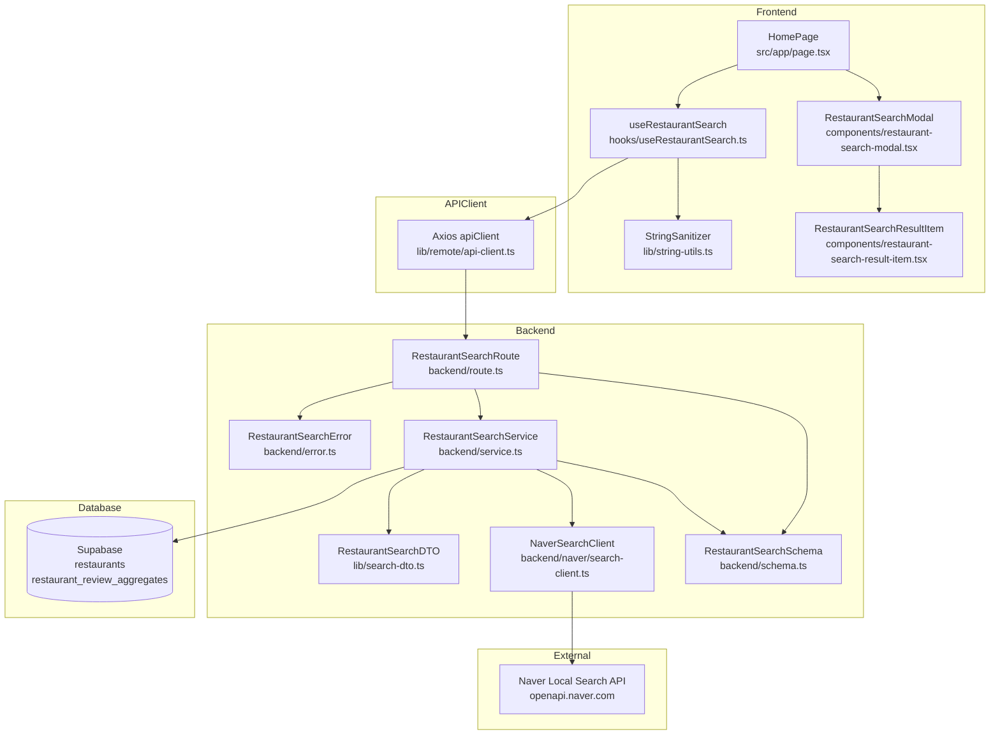

# Implementation Plan: UC-002 음식점 검색

## 개요

| 모듈 | 위치 | 설명 |
|------|------|------|
| **RestaurantSearchSchema** | `src/features/restaurant/backend/schema.ts` | 검색 요청/응답 및 네이버 API 응답 검증용 Zod 스키마 확장 |
| **RestaurantSearchError** | `src/features/restaurant/backend/error.ts` | 검색 로직 전용 에러 코드 정의 |
| **NaverSearchClient** | `src/features/restaurant/backend/naver/search-client.ts` | 네이버 장소 검색 API 호출/타임아웃/정규화 담당 모듈 |
| **RestaurantSearchService** | `src/features/restaurant/backend/service.ts` | 네이버 응답과 DB를 조합해 검색 결과 DTO를 구성하는 비즈니스 로직 |
| **RestaurantSearchRoute** | `src/features/restaurant/backend/route.ts` | `POST /api/restaurants/search` 엔드포인트 라우팅 및 검증 |
| **RestaurantSearchDTO** | `src/features/restaurant/lib/search-dto.ts` | 프론트엔드에서 재사용할 검색 DTO 내보내기 |
| **useRestaurantSearch** | `src/features/restaurant/hooks/useRestaurantSearch.ts` | React Query 기반 검색 뮤테이션 훅, 요청 취소 및 에러 메시지 처리 |
| **RestaurantSearchModal** | `src/features/restaurant/components/restaurant-search-modal.tsx` | 검색 결과 모달 컴포넌트(목록, 빈 상태, 에러 상태 포함) |
| **RestaurantSearchResultItem** | `src/features/restaurant/components/restaurant-search-result-item.tsx` | 단일 검색 결과 카드, 리뷰 작성 버튼 포함 |
| **HomePage Search Integration** | `src/app/page.tsx` | 검색 폼 UX, 모달 트리거, 디바운싱/중복 요청 차단 로직 통합 |
| **StringSanitizer Utility** | `src/lib/string-utils.ts` | 네이버 응답의 HTML 태그 제거/공백 정규화 유틸 |
| **Backend Config Extension** | `src/backend/config/index.ts` | 네이버 API 자격증명 및 타임아웃 환경변수 파싱 |

## Diagram

## Implementation Plan

### 1. 프론트엔드 프레젠테이션 레이어

#### 1.1 RestaurantSearchModal — `src/features/restaurant/components/restaurant-search-modal.tsx`
- Shadcn Dialog 컴포넌트가 없으므로 다음 명령으로 설치 후 래핑 컴포넌트 구성: `npx shadcn@latest add dialog`.
- `"use client"` 선언 후 `Dialog`, `DialogContent`, `DialogHeader` 등을 활용하여 검색 결과를 표시.
- props: `isOpen`, `onClose`, `state`(loading/error/success), `results`, `keyword`, `onRetry`, `onReview`.
- 로딩 시 스피너, 성공 시 리스트, 빈 결과 시 가이드 메시지, 에러 시 Toast가 아닌 모달 내 폴백 문구 + 재시도 버튼을 제공.
- 모달 열릴 때 `document.body` 스크롤 비활성화 처리(Dialog 기본 기능 사용).
- 접근성: 제목/설명 `aria` 속성 지정, ESC/바깥 클릭 닫기 지원.

**QA Sheet**
| 시나리오 | 입력 | 기대 결과 |
|----------|------|------------|
| 모달 열림 | `isOpen=true`, results `[]>` | 모달이 중앙에 표시되고 헤더에 검색어 노출 |
| 로딩 상태 | `state="loading"` | 스켈레톤/스피너 표시, 결과 목록 숨김 |
| 빈 결과 | `state="success"`, `results=[]` | "검색 결과가 없습니다" 메시지와 재검색 유도 문구 노출 |
| 에러 상태 | `state="error"` | 오류 메시지와 `onRetry` 버튼 노출, 버튼 클릭 시 핸들러 호출 |
| 닫기 이벤트 | 배경 클릭 또는 ESC | `onClose` 호출, 모달 닫힘 |

#### 1.2 RestaurantSearchResultItem — `src/features/restaurant/components/restaurant-search-result-item.tsx`
- `"use client"` 컴포넌트로, 음식점 이름/주소/카테고리/리뷰 버튼을 표시.
- `Button` 컴포넌트 재사용, 이름 영역 클릭 시 `router.push(/restaurant/{id})` 등은 추후 세부 유스케이스에 분리, 본 유스케이스에서는 리뷰 작성 버튼만 연결.
- HTML 태그 제거된 문자열만 표시하도록 props 진입 시 Sanitizer 적용 (hook에서 처리되지만 방어적으로 once more `dangerouslySetInnerHTML` 미사용).
- `onReview` 콜백에 현재 항목 전달하여 상위에서 라우팅/ensure 로직 처리.

**QA Sheet**
| 시나리오 | 입력 | 기대 결과 |
|----------|------|------------|
| 기본 렌더링 | 필수 필드 제공 | 이름/주소/카테고리/버튼이 정렬되어 노출 |
| 카테고리 없음 | `category=null` | 카테고리 영역에 "정보 없음" 노출 |
| 버튼 클릭 | 리뷰 버튼 클릭 | 상위 `onReview` 호출, aria-pressed 변화 없음 |

#### 1.3 HomePage Search Integration — `src/app/page.tsx`
- 기존 검색 폼 로직을 확장하여 `useRestaurantSearch`와 `RestaurantSearchModal` 연동.
- 공백 검색 차단: 제출 시 `trim` 후 빈 문자열이면 `toast`로 안내하고 조기 반환.
- 제출 시 기존 쿼리 파라미터 갱신과 동시에 `mutation.mutate` 호출, 동일 키워드 1초 내 중복 호출 시 `AbortController`를 이용해 이전 요청 취소.
- 모달 상태(`isModalOpen`)를 로컬 상태로 관리, 검색 성공 시 자동 열림, 닫기 시 결과 초기화 여부 결정(검색 히스토리 유지 고려).
- 오류 발생 시 `toast`(destructive variant)로 에러 메시지 표시.
- ESC 및 검색어 변경 시 모달 제어 로직 명확화.

**QA Sheet**
| 시나리오 | 입력 | 기대 결과 |
|----------|------|------------|
| 빈 문자열 검색 | `"   "` | API 미호출, 인풋 포커스 유지, 경고 토스트 표시 |
| 정상 검색 | `"강남 맛집"` | 로딩 동안 버튼 disabled, 완료 후 모달 열림 및 결과 표시 |
| 연속 검색 | 1초 내 다른 키워드 | 이전 요청 취소, 마지막 키워드 결과만 유지 |
| 오류 발생 | 네트워크 에러 모의 | 에러 토스트 + 모달 error 상태 전환 |

### 2. 프론트엔드 상태/유틸 레이어

#### 2.1 useRestaurantSearch — `src/features/restaurant/hooks/useRestaurantSearch.ts`
- `useMutation` 사용, `mutationFn`에서 `apiClient.post('/api/restaurants/search', { keyword })` 호출.
- `AbortController`를 mutation context에 보관해 재진입 시 `abort()` 호출.
- 응답은 `RestaurantSearchListSchema`로 검증 후 반환, 실패 시 `extractApiErrorMessage` 사용.
- 성공 시 결과를 정렬(예: 리뷰 수 우선), `onSuccess`에서 모달 오픈 트리거 반환 가능하도록 커스텀 객체 리턴.
- 훅은 상태 전환(`status`, `error`, `reset`)과 함께 제공.

#### 2.2 StringSanitizer Utility — `src/lib/string-utils.ts`
- 함수 `stripHtmlTags(value: string): string` 구현 (정규식으로 `<[^>]*>` 제거 후 `trim` 및 연속 공백 단일화).
- 함수 `normalizeSpaces(value: string): string` 등 재사용 가능한 헬퍼 포함하여 서비스/훅 모두 재사용.
- 유틸은 pure function으로 작성하고 유닛 테스트 대상에 포함.

### 3. 백엔드 레이어

#### 3.1 Backend Config Extension — `src/backend/config/index.ts`
- `NAVER_SEARCH_API_BASE_URL`(기본값 `https://openapi.naver.com/v1/search/local.json`), `NAVER_SEARCH_CLIENT_ID`, `NAVER_SEARCH_CLIENT_SECRET`, `NAVER_SEARCH_TIMEOUT_MS` 환경 변수를 `zod`로 검증.
- `AppConfig` 타입을 확장하여 `naver.search` 섹션 추가, `withAppContext` 미변경 유지.
- 누락 시 명확한 에러 메시지로 앱 부팅 실패 처리.

#### 3.2 RestaurantSearchSchema — `src/features/restaurant/backend/schema.ts`
- 요청 본문: `{ keyword: z.string().trim().min(1).max(100) }` 정의.
- 네이버 API 아이템 스키마: `title`, `category`, `roadAddress`, `address`, `mapx/mapy`, `link` 등 필드 검증 (`z.coerce.number()`로 지도 좌표 변환, HTML 제거는 서비스에서 수행).
- 응답 DTO: `{ restaurantId: string | null, name, address, category, latitude, longitude, naverPlaceId }` 배열 스키마 정의 후 `RestaurantSearchListSchema`로 export.

#### 3.3 RestaurantSearchError — `src/features/restaurant/backend/error.ts`
- `searchRequestInvalid`, `searchUpstreamFailed`, `searchValidationFailed`, `searchTimeout`, `searchDBLookupFailed` 등 코드 추가.

#### 3.4 NaverSearchClient — `src/features/restaurant/backend/naver/search-client.ts`
- `fetch` 기반으로 구현, `AbortController`와 `setTimeout` 콤비로 10초 타임아웃 구현 (config 값 사용).
- 요청 헤더에 `X-Naver-Client-Id`, `X-Naver-Client-Secret` 포함, `query`, `display=10`, `sort=sim` 파라미터 구성.
- HTTP 200 외 상태 시 `restaurantErrorCodes.searchUpstreamFailed`에 매핑될 에러 throw.
- 응답 JSON 파싱 후 `RestaurantSearchNaverItemSchema`로 검증하여 안전성 확보.

**Unit Tests**
- 정상 응답 -> 올바른 fetch 옵션/헤더/timeout 적용 확인 (fetch mocking).
- 타임아웃 발생 시 `AbortError` throw 여부 검증.
- 4xx/5xx 응답 시 에러 객체 메시지 확인.

#### 3.5 RestaurantSearchService — `src/features/restaurant/backend/service.ts`
- `searchRestaurants(keyword, supabase, naverClient, sanitizer)` 함수 추가.
- 네이버 결과 반복 처리 중 HTML 태그 제거 및 공백 정규화.
- DB 조회: `naver_place_id` 컬렉션으로 일괄 조회(`.in`) 후 Map 구성, 존재하면 기존 `id`를 결과에 포함.
- 좌표가 누락된 항목은 결과에서 제외(또는 플래그로 전달) — 스펙 EC-008 반영해 `hasCoordinate=false` 필드를 추가 고려.
- 최종 결과를 `RestaurantSearchListSchema`로 검증 후 success 반환.
- 실패 케이스마다 적절한 `failure` 코드 리턴, 로거로 오류 기록.

**Unit Tests**
- 네이버 응답 + DB 매핑 성공 케이스 (좌표, HTML 제거, 정렬 포함).
- 좌표 누락 항목 처리 시 제외/표시 로직 검증.
- Supabase 에러 모킹 시 `searchDBLookupFailed` 코드 반환 확인.
- Zod 검증 실패 시 `searchValidationFailed` 코드 반환 확인.

#### 3.6 RestaurantSearchRoute — `src/features/restaurant/backend/route.ts`
- `app.post('/api/restaurants/search', ...)` 추가, body JSON 추출 후 스키마 검증 실패 시 400 에러 반환.
- 성공 시 `respond` 사용, 에러 시 logger.error 호출.
- `registerRestaurantRoutes` 내에서 기존 마커 라우트와 함께 노출.

### 4. DTO 및 공유 레이어

#### 4.1 RestaurantSearchDTO — `src/features/restaurant/lib/search-dto.ts`
- 백엔드 스키마의 `RestaurantSearchResultSchema`, `RestaurantSearchListSchema` 등을 재노출하여 프론트 타입 공유.
- 추가적으로 `RestaurantSearchResult` 타입 alias export.

### 5. 테스트 및 검증 전략 요약
- 프론트 QA 시나리오는 Storybook 없이 Playwright 대신 수동 체크 리스트 기반으로 진행.
- 비즈니스 로직 테스트는 `vitest` 도입 (devDependency 추가, `tsconfig` paths 반영). `package.json`에 `test` 스크립트 추가 계획.
- `StringSanitizer` 유틸도 단위 테스트에 포함하여 HTML 제거 및 공백 정규화 케이스 검증.

## 호환성 및 충돌 검토
- 신규 라우트는 `/api/restaurants/search`로, 기존에 동일 경로 미사용 확인 (검색).
- `RestaurantSearchSchema` 확장은 기존 마커 스키마 namespace와 충돌 없도록 별도 export 명 유지.
- `AppConfig` 확장 시 캐시 로직 유지하되, 기존 호출부(withAppContext)가 구조분해를 사용하지 않아 런타임 오류 발생하지 않음.
- `HomePage` 수정은 지도 기능과 분리된 영역을 터치하므로 `NaverMap` 연동과 충돌 없음 (폼 submit 핸들러만 확장).
- `apiClient` 공용 인스턴스를 그대로 사용하므로 추가 네이밍 충돌 없음. 단, BASE URL 비어 있어 상대경로 호출 시 Next API로 전달되도록 현 구조 유지.
- `shadcn` Dialog 설치는 기존 UI 디렉터리에 신규 파일 추가하므로 다른 컴포넌트와 중복되지 않음.
