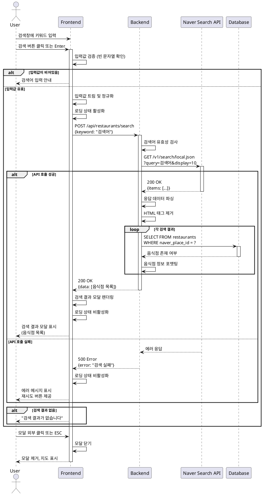

# UC-002: 음식점 검색

## Primary Actor
일반 사용자 (맛집을 검색하고자 하는 방문자)

## Precondition
- 사용자가 메인 페이지(`/`)에 접속한 상태
- 네이버 지도가 정상적으로 로드되어 있음
- 검색창이 활성화되어 입력 가능한 상태

## Trigger
사용자가 검색창에 키워드를 입력하고 검색 버튼을 클릭하거나 Enter 키를 입력

## Main Scenario

1. 사용자가 검색창에 음식점 관련 키워드를 입력한다 (예: "강남 맛집", "스타벅스").
2. 사용자가 검색 버튼을 클릭하거나 Enter 키를 누른다.
3. 시스템은 입력값을 검증한다 (빈 문자열, 공백 확인).
4. 시스템은 입력값을 트림하고 정규화한다.
5. 시스템은 로딩 상태를 활성화하고 로딩 인디케이터를 표시한다.
6. 시스템은 백엔드 API(`POST /api/restaurants/search`)를 호출한다.
7. 백엔드는 네이버 장소 검색 API를 호출하여 상위 10개 결과를 조회한다.
8. 백엔드는 각 검색 결과에 대해 내부 DB에서 음식점 존재 여부를 확인한다.
9. 백엔드는 음식점 정보를 포맷팅하여 응답한다.
10. 시스템은 검색 결과 모달을 화면 중앙에 오버레이로 표시한다.
11. 모달에는 검색어, 결과 개수, 음식점 목록(최대 10개)이 표시된다.
12. 각 음식점 항목에는 이름, 주소, 카테고리, 리뷰 작성 버튼이 포함된다.
13. 사용자는 모달 외부 클릭 또는 ESC 키로 모달을 닫을 수 있다.

## Edge Cases

### EC-001: 빈 검색어 입력
- **상황**: 사용자가 공백만 입력하거나 빈 문자열로 검색 시도
- **처리**: 
  - 검색을 실행하지 않는다.
  - 입력창에 포커스를 유지한다.
  - 검색어 입력 안내 메시지를 표시한다.

### EC-002: 검색 결과 없음
- **상황**: 네이버 검색 API가 빈 결과를 반환함
- **처리**:
  - 모달에 "검색 결과가 없습니다" 메시지를 표시한다.
  - 검색어 재입력을 유도하는 안내 문구를 제공한다.
  - 모달 닫기 버튼을 제공한다.

### EC-003: 네이버 API 호출 실패
- **상황**: 네트워크 에러, 타임아웃, 또는 API 서버 오류 발생
- **처리**:
  - 10초 타임아웃을 설정한다.
  - 에러 토스트 메시지를 표시한다.
  - 재시도 버튼을 제공한다.
  - 입력된 검색어를 유지한다.

### EC-004: API Rate Limit 초과
- **상황**: 네이버 API 일일 호출 한도 초과
- **처리**:
  - 일시적 사용 제한 안내 메시지를 표시한다.
  - 재시도 대기 시간을 안내한다.
  - 관리자에게 알림을 전송한다.

### EC-005: 응답 데이터 형식 오류
- **상황**: 네이버 API 응답 데이터가 예상 형식과 다름
- **처리**:
  - 데이터 검증을 수행한다.
  - 유효하지 않은 항목은 건너뛴다.
  - 유효한 결과만 모달에 표시한다.
  - 에러를 로깅한다.

### EC-006: 중복 검색 요청
- **상황**: 이전 검색이 진행 중인 상태에서 새로운 검색 요청
- **처리**:
  - 이전 요청을 취소한다.
  - 최신 검색만 처리한다 (디바운싱 적용).
  - 로딩 상태를 유지한다.

### EC-007: HTML 태그 포함 응답
- **상황**: 네이버 API 응답에 `<b>` 태그 등이 포함됨
- **처리**:
  - HTML 태그를 제거하여 순수 텍스트만 표시한다.
  - XSS 공격을 방지한다.

### EC-008: 좌표 정보 누락
- **상황**: 일부 검색 결과에 위도/경도 정보가 없음
- **처리**:
  - 해당 항목을 결과에 포함하되 리뷰 작성 시 좌표 없음을 안내한다.
  - 또는 좌표 없는 항목은 필터링한다.

## Business Rules

### BR-001: 검색 결과 제한
- 네이버 검색 API를 통해 최대 10개의 결과만 표시한다.
- 더 많은 결과가 필요한 경우 검색어를 구체화하도록 안내한다.

### BR-002: 검색어 정규화
- 입력된 검색어의 앞뒤 공백을 제거한다.
- 연속된 공백은 하나의 공백으로 변환한다.
- 특수문자는 그대로 유지한다.

### BR-003: 검색 히스토리
- 검색 히스토리는 로컬 스토리지에 저장할 수 있다 (선택 사항).
- 최대 10개의 최근 검색어를 저장한다.

### BR-004: 네이버 API 연동
- 네이버 장소 검색 API(`/v1/search/local.json`)를 사용한다.
- Client ID와 Client Secret은 서버 측에서만 사용한다.
- 검색 결과는 정확도순으로 정렬한다.

### BR-005: 응답 데이터 포맷
- 음식점 이름, 주소, 카테고리는 필수 정보다.
- 위도/경도는 선택 정보로 처리한다.
- 네이버 플레이스 ID가 있는 경우 저장한다.

### BR-006: 모달 동작
- 모달은 검색 실행 시에만 표시된다.
- 모달 외부 클릭 또는 ESC 키로 닫을 수 있다.
- 모달이 열려 있을 때 배경 스크롤을 비활성화한다.

### BR-007: 검색 제한
- 동일한 검색어로 1초 이내 중복 검색을 방지한다 (디바운싱).
- Rate Limiting을 적용하여 API 남용을 방지한다.

## Sequence Diagram

## Related Use Cases
- UC-001: 메인 페이지 초기 로드
- UC-003: 검색 결과에서 리뷰 작성
- UC-006: 검색 결과 모달 닫기

