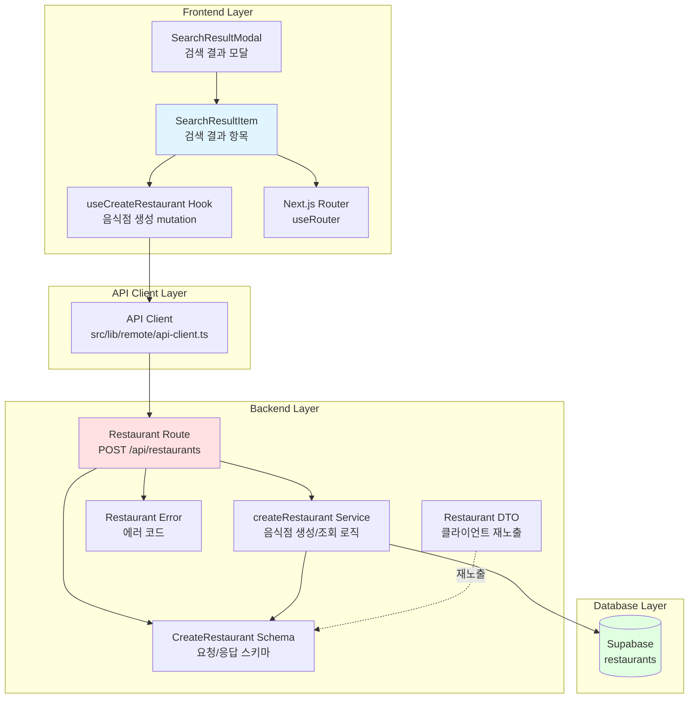

# Implementation Plan: UC-003 검색 결과 모달에서 리뷰 작성 버튼 클릭

## 개요

검색 결과 모달에서 리뷰 작성 버튼 클릭 시 음식점 정보를 DB에 저장하고 리뷰 작성 페이지로 네비게이션하는 기능을 구현합니다.

### 모듈 목록

| 모듈 | 위치 | 설명 |
|------|------|------|
| **CreateRestaurant Schema** | `src/features/restaurant/backend/schema.ts` | 음식점 생성 요청/응답 스키마 (Zod) |
| **CreateRestaurant DTO** | `src/features/restaurant/lib/dto.ts` | 클라이언트 측 DTO 재노출 |
| **createRestaurant Service** | `src/features/restaurant/backend/service.ts` | 음식점 생성/조회 비즈니스 로직 |
| **POST /api/restaurants Route** | `src/features/restaurant/backend/route.ts` | 음식점 생성 엔드포인트 |
| **Restaurant Error Codes** | `src/features/restaurant/backend/error.ts` | 에러 코드 추가 |
| **useCreateRestaurant Hook** | `src/features/restaurant/hooks/useCreateRestaurant.ts` | React Query mutation 훅 |
| **SearchResultItem Component** | `src/features/restaurant/components/search-result-item.tsx` | 검색 결과 항목 컴포넌트 |
| **SearchResultModal Component** | `src/features/restaurant/components/search-result-modal.tsx` | 검색 결과 모달 (UC-002에서 생성) |

---

## Diagram



---

## Implementation Plan

### 1. Backend Layer

#### 1.1. Schema: `src/features/restaurant/backend/schema.ts`

**목적**: 음식점 생성 요청/응답 스키마 정의

**구현 내용**:
```typescript
// 기존 스키마에 추가

export const CreateRestaurantRequestSchema = z.object({
  name: z.string().min(1).max(255),
  address: z.string().min(1),
  category: z.string().max(100).nullable().optional(),
  latitude: z.number().min(-90).max(90),
  longitude: z.number().min(-180).max(180),
  naver_place_id: z.string().max(255).nullable().optional(),
});

export const CreateRestaurantResponseSchema = z.object({
  id: z.string().uuid(),
  name: z.string(),
  address: z.string(),
  category: z.string().nullable(),
  latitude: z.number(),
  longitude: z.number(),
  naver_place_id: z.string().nullable(),
  isNew: z.boolean(), // 새로 생성되었는지 여부
});

export type CreateRestaurantRequest = z.infer<typeof CreateRestaurantRequestSchema>;
export type CreateRestaurantResponse = z.infer<typeof CreateRestaurantResponseSchema>;
```

**Unit Tests**:
- ✅ 유효한 음식점 데이터 파싱 성공
- ✅ 필수 필드 누락 시 파싱 실패
- ✅ 좌표 범위 초과 시 파싱 실패
- ✅ 카테고리 null 허용 확인

#### 1.2. Service: `src/features/restaurant/backend/service.ts`

**목적**: 음식점 생성/조회 비즈니스 로직

**구현 내용**:
```typescript
export const createRestaurant = async (
  client: SupabaseClient,
  data: CreateRestaurantRequest,
): Promise<HandlerResult<CreateRestaurantResponse, RestaurantServiceError>> => {
  // 1. naver_place_id로 기존 음식점 조회
  if (data.naver_place_id) {
    const { data: existing, error: selectError } = await client
      .from('restaurants')
      .select('*')
      .eq('naver_place_id', data.naver_place_id)
      .maybeSingle();

    if (selectError) {
      return failure(500, restaurantErrorCodes.createFailed, selectError.message);
    }

    if (existing) {
      const validated = CreateRestaurantResponseSchema.safeParse({
        ...existing,
        isNew: false,
      });

      if (!validated.success) {
        return failure(
          500,
          restaurantErrorCodes.validationFailed,
          'Failed to validate existing restaurant data',
        );
      }

      return success(validated.data);
    }
  }

  // 2. 새 음식점 생성
  const { data: created, error: insertError } = await client
    .from('restaurants')
    .insert({
      name: data.name,
      address: data.address,
      category: data.category ?? null,
      latitude: data.latitude,
      longitude: data.longitude,
      naver_place_id: data.naver_place_id ?? null,
    })
    .select()
    .single();

  if (insertError) {
    // UNIQUE 제약조건 위반 (Race Condition)
    if (insertError.code === '23505' && data.naver_place_id) {
      // 재조회
      const { data: existing } = await client
        .from('restaurants')
        .select('*')
        .eq('naver_place_id', data.naver_place_id)
        .single();

      if (existing) {
        const validated = CreateRestaurantResponseSchema.safeParse({
          ...existing,
          isNew: false,
        });

        if (validated.success) {
          return success(validated.data);
        }
      }
    }

    return failure(500, restaurantErrorCodes.createFailed, insertError.message);
  }

  const validated = CreateRestaurantResponseSchema.safeParse({
    ...created,
    isNew: true,
  });

  if (!validated.success) {
    return failure(
      500,
      restaurantErrorCodes.validationFailed,
      'Failed to validate created restaurant data',
    );
  }

  return success(validated.data);
};
```

**Unit Tests**:
- ✅ 새 음식점 생성 성공
- ✅ 기존 음식점 조회 성공 (naver_place_id 일치)
- ✅ Race Condition 처리 (UNIQUE 제약조건 위반)
- ✅ 필수 정보 누락 시 실패
- ✅ 데이터베이스 에러 처리

#### 1.3. Error: `src/features/restaurant/backend/error.ts`

**목적**: 에러 코드 추가

**구현 내용**:
```typescript
// 기존 에러 코드에 추가
export const restaurantErrorCodes = {
  // ... 기존 코드
  createFailed: 'RESTAURANT_CREATE_FAILED',
  validationFailed: 'RESTAURANT_VALIDATION_FAILED',
  incompleteData: 'RESTAURANT_INCOMPLETE_DATA',
} as const;
```

#### 1.4. Route: `src/features/restaurant/backend/route.ts`

**목적**: POST /api/restaurants 엔드포인트 구현

**구현 내용**:
```typescript
// registerRestaurantRoutes 함수에 추가
app.post('/api/restaurants', async (c) => {
  const body = await c.req.json();
  const parsedBody = CreateRestaurantRequestSchema.safeParse(body);

  if (!parsedBody.success) {
    return respond(
      c,
      failure(
        400,
        restaurantErrorCodes.validationFailed,
        'Invalid restaurant data',
        parsedBody.error.format(),
      ),
    );
  }

  const supabase = getSupabase(c);
  const logger = getLogger(c);

  const result = await createRestaurant(supabase, parsedBody.data);

  if (!result.ok) {
    const errorResult = result as ErrorResult<RestaurantServiceError, unknown>;
    logger.error('Failed to create restaurant', errorResult.error.message);
  }

  return respond(c, result);
});
```

### 2. Frontend Layer

#### 2.1. DTO: `src/features/restaurant/lib/dto.ts`

**목적**: 클라이언트 측 스키마 재노출

**구현 내용**:
```typescript
export {
  CreateRestaurantRequestSchema,
  CreateRestaurantResponseSchema,
  type CreateRestaurantRequest,
  type CreateRestaurantResponse,
} from '@/features/restaurant/backend/schema';
```

#### 2.2. Hook: `src/features/restaurant/hooks/useCreateRestaurant.ts`

**목적**: 음식점 생성 React Query mutation 훅

**구현 내용**:
```typescript
'use client';

import { useMutation, useQueryClient } from '@tanstack/react-query';
import { apiClient, extractApiErrorMessage } from '@/lib/remote/api-client';
import {
  CreateRestaurantRequestSchema,
  CreateRestaurantResponseSchema,
  type CreateRestaurantRequest,
  type CreateRestaurantResponse,
} from '@/features/restaurant/lib/dto';

const createRestaurant = async (
  data: CreateRestaurantRequest,
): Promise<CreateRestaurantResponse> => {
  try {
    const validated = CreateRestaurantRequestSchema.parse(data);
    const { data: response } = await apiClient.post('/api/restaurants', validated);
    return CreateRestaurantResponseSchema.parse(response);
  } catch (error) {
    const message = extractApiErrorMessage(
      error,
      '음식점 정보를 저장하지 못했습니다.',
    );
    throw new Error(message);
  }
};

export const useCreateRestaurant = () => {
  const queryClient = useQueryClient();

  return useMutation({
    mutationFn: createRestaurant,
    onSuccess: () => {
      // 마커 목록 무효화 (새 음식점이 추가될 수 있음)
      queryClient.invalidateQueries({ queryKey: ['restaurants', 'markers'] });
    },
  });
};
```

#### 2.3. Component: `src/features/restaurant/components/search-result-item.tsx`

**목적**: 검색 결과 항목 컴포넌트 (리뷰 작성 버튼 포함)

**구현 내용**:
```typescript
'use client';

import { useState } from 'react';
import { useRouter } from 'next/navigation';
import { Button } from '@/components/ui/button';
import { useToast } from '@/hooks/use-toast';
import { useCreateRestaurant } from '@/features/restaurant/hooks/useCreateRestaurant';
import type { CreateRestaurantRequest } from '@/features/restaurant/lib/dto';

type SearchResultItemProps = {
  restaurant: {
    name: string;
    address: string;
    category?: string | null;
    latitude: number;
    longitude: number;
    naver_place_id?: string | null;
  };
  onNavigate?: () => void; // 모달 닫기 콜백
};

export const SearchResultItem = ({
  restaurant,
  onNavigate,
}: SearchResultItemProps) => {
  const router = useRouter();
  const { toast } = useToast();
  const createRestaurantMutation = useCreateRestaurant();
  const [isProcessing, setIsProcessing] = useState(false);

  const handleReviewButtonClick = async () => {
    if (isProcessing) return;

    setIsProcessing(true);

    try {
      const requestData: CreateRestaurantRequest = {
        name: restaurant.name,
        address: restaurant.address,
        category: restaurant.category ?? null,
        latitude: restaurant.latitude,
        longitude: restaurant.longitude,
        naver_place_id: restaurant.naver_place_id ?? null,
      };

      const result = await createRestaurantMutation.mutateAsync(requestData);

      // 리뷰 작성 페이지로 네비게이션
      router.push(`/review/create?restaurantId=${result.id}`);

      // 모달 닫기
      onNavigate?.();
    } catch (error) {
      toast({
        variant: 'destructive',
        title: '오류',
        description:
          error instanceof Error
            ? error.message
            : '음식점 정보를 저장하지 못했습니다.',
      });
    } finally {
      setIsProcessing(false);
    }
  };

  return (
    <div className="flex items-center justify-between gap-4 rounded-lg border border-slate-200 bg-white p-4 hover:bg-slate-50">
      <div className="flex-1 space-y-1">
        <h3 className="font-medium text-slate-900">{restaurant.name}</h3>
        <p className="text-sm text-slate-600">{restaurant.address}</p>
        {restaurant.category && (
          <p className="text-xs text-slate-500">{restaurant.category}</p>
        )}
      </div>
      <Button
        onClick={handleReviewButtonClick}
        disabled={isProcessing}
        variant="default"
        size="sm"
      >
        {isProcessing ? '처리 중...' : '리뷰 작성'}
      </Button>
    </div>
  );
};
```

**QA Sheet**:
- ✅ 리뷰 작성 버튼 클릭 시 음식점 생성 API 호출
- ✅ 성공 시 리뷰 작성 페이지로 네비게이션
- ✅ 실패 시 에러 토스트 표시
- ✅ 처리 중 버튼 비활성화 및 로딩 텍스트 표시
- ✅ 연속 클릭 방지 (isProcessing 플래그)
- ✅ 필수 정보 누락 시 적절한 에러 메시지
- ✅ 모달 닫기 콜백 호출 확인

#### 2.4. Component 통합: `src/features/restaurant/components/search-result-modal.tsx`

**목적**: SearchResultItem 컴포넌트 통합

**구현 내용**:
```typescript
// UC-002에서 생성된 SearchResultModal에 SearchResultItem 통합
import { SearchResultItem } from './search-result-item';

// 검색 결과 렌더링 부분
{results.map((restaurant) => (
  <SearchResultItem
    key={restaurant.naver_place_id || restaurant.name}
    restaurant={restaurant}
    onNavigate={onClose}
  />
))}
```

### 3. Integration & Testing

#### 3.1. 통합 테스트 시나리오

1. **정상 플로우**:
   - 검색 결과 모달에서 리뷰 작성 버튼 클릭
   - 음식점 정보 저장 성공
   - 리뷰 작성 페이지로 네비게이션
   - 모달 자동 닫힘

2. **기존 음식점 플로우**:
   - 이미 DB에 존재하는 음식점의 리뷰 작성 버튼 클릭
   - 기존 ID 반환
   - 리뷰 작성 페이지로 네비게이션

3. **에러 처리**:
   - 네트워크 에러 시 토스트 표시
   - 필수 정보 누락 시 에러 메시지
   - 버튼 재활성화 확인

#### 3.2. 기존 코드베이스와의 충돌 검증

- ✅ `src/features/restaurant/backend/route.ts`: 기존 GET 라우트와 충돌 없음
- ✅ `src/features/restaurant/backend/service.ts`: 기존 getRestaurantMarkers와 독립적
- ✅ `src/features/restaurant/backend/schema.ts`: 기존 스키마와 네이밍 충돌 없음
- ✅ `src/features/restaurant/backend/error.ts`: 기존 에러 코드와 중복 없음
- ✅ Database: restaurants 테이블은 UC-001에서 이미 생성됨

### 4. 개발 순서

1. **Backend 구현** (순서대로):
   - Schema 정의
   - Error 코드 추가
   - Service 로직 구현 및 테스트
   - Route 엔드포인트 구현

2. **Frontend 구현** (순서대로):
   - DTO 재노출
   - useCreateRestaurant 훅 구현
   - SearchResultItem 컴포넌트 구현
   - SearchResultModal 통합

3. **통합 테스트**:
   - E2E 시나리오 테스트
   - 에러 케이스 검증

### 5. 의존성

- **선행 작업**: UC-002 (음식점 검색) 완료 필요
- **후속 작업**: UC-007 (리뷰 작성 페이지 로드)에서 restaurantId 파라미터 처리

