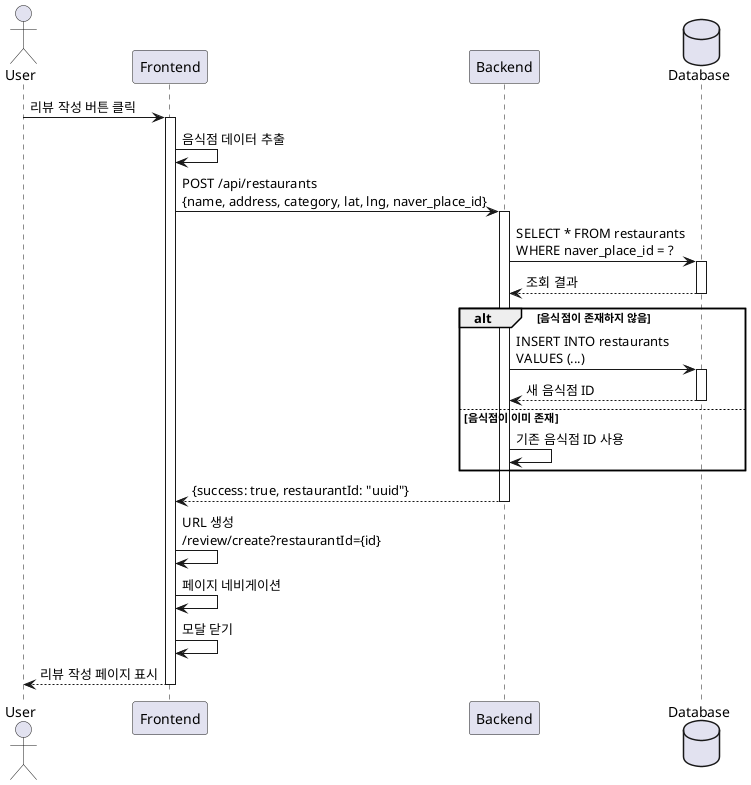

# UC-003: 검색 결과 모달에서 리뷰 작성 버튼 클릭

## Primary Actor
일반 사용자 (맛집 리뷰를 작성하고자 하는 사용자)

## Precondition
- 사용자가 메인 페이지에서 음식점 검색을 완료한 상태
- 검색 결과 모달이 화면에 표시되어 있음
- 검색 결과 목록에 1개 이상의 음식점이 존재함

## Trigger
사용자가 검색 결과 목록에서 특정 음식점의 "리뷰 작성" 버튼을 클릭

## Main Scenario

1. 사용자가 검색 결과 모달에서 원하는 음식점의 리뷰 작성 버튼을 클릭한다
2. 시스템은 선택된 음식점의 네이버 플레이스 ID를 추출한다
3. 시스템은 해당 음식점이 내부 데이터베이스에 존재하는지 확인한다
4. **음식점이 DB에 존재하지 않는 경우:**
   - 시스템은 음식점 정보(이름, 주소, 카테고리, 좌표, 네이버 플레이스 ID)를 데이터베이스에 저장한다
   - 시스템은 새로 생성된 음식점 ID를 획득한다
5. **음식점이 이미 존재하는 경우:**
   - 시스템은 기존 음식점 ID를 사용한다
6. 시스템은 리뷰 작성 페이지 URL을 생성한다 (`/review/create?restaurantId={id}`)
7. 시스템은 해당 URL로 페이지 네비게이션을 실행한다
8. 검색 결과 모달이 자동으로 닫힌다
9. 리뷰 작성 페이지가 표시된다

## Edge Cases

### 음식점 정보 저장 실패
- **원인**: 네트워크 오류, 서버 에러, 데이터베이스 연결 실패
- **처리**: 에러 메시지 토스트 표시, 재시도 버튼 제공, 네비게이션 중단

### 필수 정보 누락
- **원인**: 네이버 API 응답에 이름 또는 주소 정보가 없음
- **처리**: "음식점 정보가 불완전합니다" 안내 메시지 표시, 리뷰 작성 불가 처리

### 중복 저장 시도 (Race Condition)
- **원인**: 동시에 여러 사용자가 같은 음식점에 대해 리뷰 작성 시도
- **처리**: 데이터베이스 UNIQUE 제약조건으로 처리, 충돌 시 기존 레코드 ID 반환

### 네비게이션 실패
- **원인**: 라우터 오류, 잘못된 URL 생성
- **처리**: 라우터 에러 핸들링, 현재 페이지 유지, 에러 메시지 표시

### 연속 클릭
- **원인**: 사용자가 버튼을 빠르게 여러 번 클릭
- **처리**: 디바운싱 적용, 첫 번째 클릭만 처리, 처리 중 버튼 비활성화

## Business Rules

- BR-001: 음식점 정보는 네이버 플레이스 ID를 기준으로 중복 저장을 방지한다
- BR-002: 음식점 이름과 주소는 필수 정보이며, 누락 시 저장하지 않는다
- BR-003: 좌표 정보(위도, 경도)는 유효한 범위 내에 있어야 한다
- BR-004: 음식점 카테고리는 선택 사항이며, 없을 경우 NULL로 저장한다
- BR-005: 리뷰 작성 페이지로 이동 시 음식점 ID는 쿼리 파라미터로 전달한다

## Sequence Diagram

