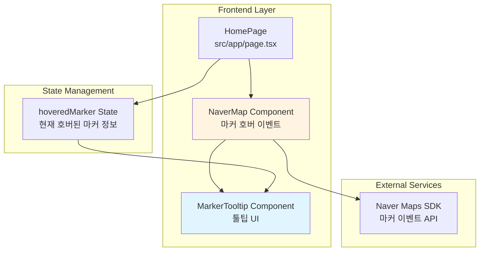

# Implementation Plan: UC-004 지도 마커 호버

## 개요

지도 마커에 마우스를 올렸을 때 음식점 정보 툴팁을 표시하는 기능을 구현합니다.

### 모듈 목록

| 모듈 | 위치 | 설명 |
|------|------|------|
| **MarkerTooltip Component** | `src/features/restaurant/components/marker-tooltip.tsx` | 마커 호버 툴팁 UI 컴포넌트 |
| **NaverMap Component** | `src/features/restaurant/components/naver-map.tsx` | 마커 호버 이벤트 핸들링 추가 (기존 파일 수정) |
| **HomePage** | `src/app/page.tsx` | 호버 상태 관리 추가 (기존 파일 수정) |

---

## Diagram



---

## Implementation Plan

### 1. Frontend Layer

#### 1.1. Component: `src/features/restaurant/components/marker-tooltip.tsx`

**목적**: 마커 호버 시 표시할 툴팁 UI 컴포넌트

**구현 내용**:
```typescript
'use client';

import type { RestaurantMarker } from '@/features/restaurant/lib/dto';

type MarkerTooltipProps = {
  marker: RestaurantMarker;
  position: { x: number; y: number };
};

export const MarkerTooltip = ({ marker, position }: MarkerTooltipProps) => {
  return (
    <div
      className="pointer-events-none fixed z-50 animate-in fade-in-0 zoom-in-95 duration-150"
      style={{
        left: `${position.x}px`,
        top: `${position.y}px`,
        transform: 'translate(-50%, -100%) translateY(-12px)',
      }}
    >
      <div className="rounded-lg border border-slate-200 bg-white px-3 py-2 shadow-lg">
        <div className="space-y-1">
          <h4 className="font-medium text-slate-900">{marker.name}</h4>
          <div className="flex items-center gap-2 text-sm">
            {marker.average_rating !== null && (
              <div className="flex items-center gap-1">
                <span className="text-yellow-500">⭐</span>
                <span className="font-medium text-slate-700">
                  {marker.average_rating.toFixed(1)}
                </span>
              </div>
            )}
            <span className="text-slate-500">
              {marker.review_count}개의 리뷰
            </span>
          </div>
          {marker.category && (
            <p className="text-xs text-slate-500">{marker.category}</p>
          )}
        </div>
        {/* 툴팁 화살표 */}
        <div className="absolute bottom-0 left-1/2 h-2 w-2 -translate-x-1/2 translate-y-1/2 rotate-45 border-b border-r border-slate-200 bg-white" />
      </div>
    </div>
  );
};
```

**QA Sheet**:
- ✅ 마커 위치에 툴팁 표시
- ✅ 음식점 이름 표시
- ✅ 평균 평점 및 별 아이콘 표시
- ✅ 리뷰 개수 표시
- ✅ 카테고리 정보 표시 (있는 경우)
- ✅ 페이드 인 애니메이션 적용
- ✅ 화면 경계 처리 (CSS transform으로 중앙 정렬)
- ✅ 툴팁 화살표 표시

#### 1.2. Component 수정: `src/features/restaurant/components/naver-map.tsx`

**목적**: 마커 호버 이벤트 핸들링 추가

**구현 내용**:
```typescript
// 기존 NaverMapProps에 추가
type NaverMapProps = {
  // ... 기존 props
  onMarkerHover?: (marker: RestaurantMarker) => void;
  onMarkerLeave?: () => void;
};

// 마커 생성 로직에 이벤트 리스너 추가
const createMarker = (marker: RestaurantMarker) => {
  const naverMarker = new naver.maps.Marker({
    position: new naver.maps.LatLng(marker.latitude, marker.longitude),
    map: mapInstance,
    // ... 기존 설정
  });

  // 호버 이벤트 (마우스 오버)
  naver.maps.Event.addListener(naverMarker, 'mouseover', () => {
    onMarkerHover?.(marker);
  });

  // 호버 해제 이벤트 (마우스 아웃)
  naver.maps.Event.addListener(naverMarker, 'mouseout', () => {
    onMarkerLeave?.();
  });

  // ... 기존 클릭 이벤트
};
```

#### 1.3. Page 수정: `src/app/page.tsx`

**목적**: 호버 상태 관리 및 툴팁 렌더링

**구현 내용**:
```typescript
// 이미 구현되어 있음 (코드베이스 확인 결과)
const [hoveredMarker, setHoveredMarker] = useState<RestaurantMarker | null>(null);
const [tooltipPosition, setTooltipPosition] = useState({ x: 0, y: 0 });

const handleMarkerHover = useCallback((marker: RestaurantMarker) => {
  setHoveredMarker(marker);
  // 마우스 위치 또는 마커 위치로 툴팁 위치 설정
  // 네이버 지도 API를 통해 마커의 화면 좌표 계산
}, []);

const handleMarkerLeave = useCallback(() => {
  setHoveredMarker(null);
}, []);

// JSX에 툴팁 추가
{hoveredMarker && (
  <MarkerTooltip marker={hoveredMarker} position={tooltipPosition} />
)}
```

### 2. Integration & Testing

#### 2.1. 통합 테스트 시나리오

1. **정상 플로우**:
   - 마커에 마우스 올리기
   - 툴팁 표시 확인
   - 마커에서 마우스 떼기
   - 툴팁 사라짐 확인

2. **빠른 이동**:
   - 여러 마커를 빠르게 지나가기
   - 디바운싱 없이 즉시 툴팁 전환 확인

3. **화면 경계**:
   - 화면 가장자리 마커 호버
   - 툴팁이 화면 밖으로 나가지 않는지 확인

#### 2.2. 기존 코드베이스와의 충돌 검증

- ✅ `src/app/page.tsx`: 이미 hoveredMarker 상태 관리 구현됨
- ✅ `src/features/restaurant/components/naver-map.tsx`: 마커 클릭 이벤트와 독립적
- ✅ 네이버 지도 SDK: mouseover/mouseout 이벤트 지원 확인

### 3. 개발 순서

1. **MarkerTooltip 컴포넌트 구현**
2. **NaverMap 컴포넌트에 호버 이벤트 추가**
3. **HomePage에서 툴팁 렌더링 (이미 구현됨)**
4. **통합 테스트**

### 4. 의존성

- **선행 작업**: UC-001 (메인 페이지 초기 로드) 완료 필요
- **후속 작업**: 없음 (독립적 기능)

