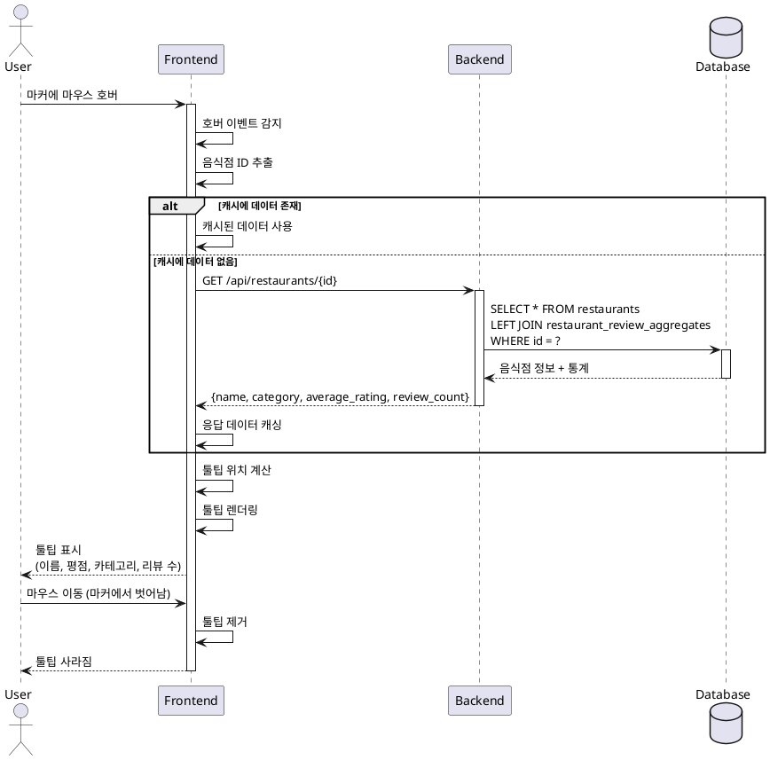

# UC-004: 지도 마커 호버

## Primary Actor
일반 사용자 (지도에서 맛집 정보를 탐색하는 사용자)

## Precondition
- 사용자가 메인 페이지에 접속한 상태
- 지도가 정상적으로 로드되어 있음
- 리뷰가 존재하는 음식점의 마커가 지도에 표시되어 있음

## Trigger
사용자가 지도 위의 마커에 마우스 커서를 올림 (hover)

## Main Scenario

1. 사용자가 지도 위의 특정 마커에 마우스를 올린다
2. 시스템은 마커 호버 이벤트를 감지한다
3. 시스템은 해당 마커와 연결된 음식점 ID를 추출한다
4. 시스템은 음식점 상세 정보를 조회한다 (캐시된 경우 캐시 사용)
5. 시스템은 응답 데이터에서 필요한 정보를 추출한다:
   - 음식점 이름
   - 평균 평점
   - 음식 카테고리
   - 리뷰 개수
6. 시스템은 마커 위치를 기준으로 툴팁 위치를 계산한다
7. 시스템은 툴팁 컴포넌트를 렌더링하여 표시한다
8. 사용자가 마커에서 마우스를 떼면 툴팁이 자동으로 사라진다

## Edge Cases

### 데이터 조회 실패
- **원인**: 네트워크 오류, API 타임아웃, 서버 에러
- **처리**: 로딩 중 메시지 표시, 타임아웃 후에도 실패 시 기본 정보만 표시 (음식점 이름)

### 평균 평점 없음
- **원인**: 리뷰는 있지만 평점 계산 오류
- **처리**: 평점 정보 미표시, 리뷰 개수만 표시

### 카테고리 정보 없음
- **원인**: 음식점 등록 시 카테고리 정보가 누락됨
- **처리**: 카테고리 필드 숨김 또는 "미분류" 기본값 표시

### 마우스 빠른 이동
- **원인**: 사용자가 여러 마커를 빠르게 지나감
- **처리**: 디바운싱 적용 (100ms), 이전 툴팁 즉시 제거

### 화면 경계 처리
- **원인**: 마커가 화면 가장자리에 위치하여 툴팁이 화면 밖으로 나갈 수 있음
- **처리**: 툴팁 위치 자동 조정, 마커 반대편에 표시

### API 응답 지연
- **원인**: 네트워크 속도 저하, 서버 부하
- **처리**: 로딩 스피너 표시, 200ms 이상 소요 시 "로딩 중" 메시지

## Business Rules

- BR-001: 툴팁은 마커 호버 시에만 표시되며, 마우스가 벗어나면 즉시 사라진다
- BR-002: 평균 평점은 소수점 첫째 자리까지 표시한다
- BR-003: 리뷰 개수는 "n개의 리뷰" 형식으로 표시한다
- BR-004: 툴팁은 지도 위에 오버레이되며, 다른 UI 요소를 가리지 않도록 z-index를 적절히 설정한다
- BR-005: 툴팁 표시 시 페이드 인 애니메이션을 적용한다 (150ms)

## Sequence Diagram

