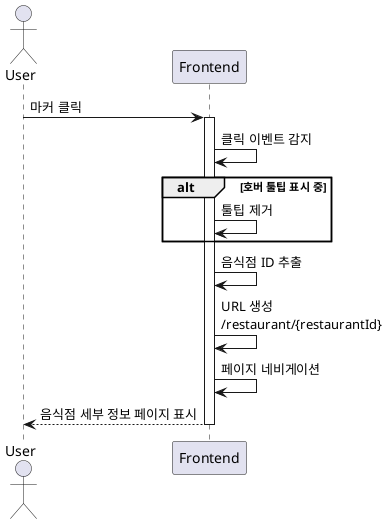

# UC-005: 지도 마커 클릭

## Primary Actor
일반 사용자 (지도에서 맛집 상세 정보를 확인하고자 하는 사용자)

## Precondition
- 사용자가 메인 페이지에 접속한 상태
- 지도가 정상적으로 로드되어 있음
- 리뷰가 존재하는 음식점의 마커가 지도에 표시되어 있음

## Trigger
사용자가 지도 위의 마커를 클릭

## Main Scenario

1. 사용자가 지도 위의 특정 마커를 클릭한다
2. 시스템은 마커 클릭 이벤트를 감지한다
3. 시스템은 현재 표시 중인 호버 툴팁이 있다면 제거한다
4. 시스템은 해당 마커와 연결된 음식점 ID를 추출한다
5. 시스템은 음식점 세부 정보 페이지 URL을 생성한다 (`/restaurant/{restaurantId}`)
6. 시스템은 해당 URL로 페이지 네비게이션을 실행한다
7. 음식점 세부 정보 페이지가 표시된다

## Edge Cases

### 음식점 ID 누락
- **원인**: 마커 데이터 오류, 메모리 손상
- **처리**: 에러 로깅, 사용자에게 에러 토스트 표시, 네비게이션 중단

### 연속 클릭
- **원인**: 사용자가 마커를 빠르게 여러 번 클릭
- **처리**: 디바운싱 적용 (300ms), 첫 번째 클릭만 처리

### 네비게이션 중 에러
- **원인**: 라우터 오류, 잘못된 URL 형식
- **처리**: 라우터 에러 핸들링, 현재 페이지 유지, 에러 메시지 표시

### 마커 데이터 불일치
- **원인**: 음식점이 삭제되었으나 마커는 아직 지도에 남아있음
- **처리**: 세부 정보 페이지에서 404 에러 처리, 메인 페이지로 리다이렉트

### 호버 툴팁 표시 중 클릭
- **원인**: 사용자가 툴팁을 보다가 마커를 클릭
- **처리**: 툴팁 즉시 제거 후 네비게이션 진행

## Business Rules

- BR-001: 마커 클릭 시 음식점 세부 정보 페이지로 즉시 이동한다
- BR-002: 페이지 전환 시 브라우저 히스토리에 새 엔트리가 추가된다
- BR-003: 음식점 ID는 URL 파라미터로 전달된다
- BR-004: 마커 클릭은 호버 이벤트보다 우선순위가 높다
- BR-005: 페이지 전환 시 부드러운 애니메이션을 적용한다

## Sequence Diagram

