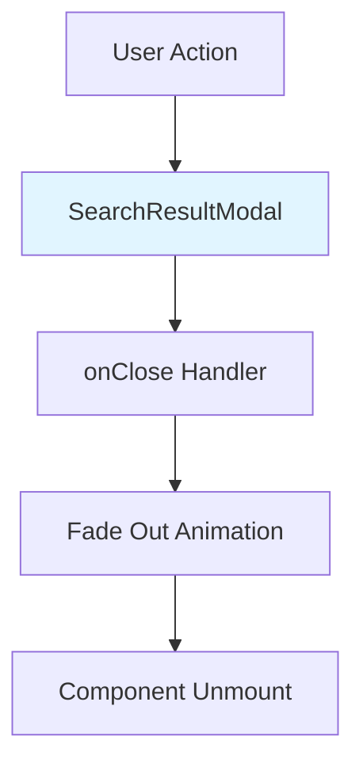

# Implementation Plan: UC-006 검색 결과 모달 닫기

## 개요

검색 결과 모달을 닫는 기능을 구현합니다 (외부 클릭, ESC 키, 닫기 버튼).

### 모듈 목록

| 모듈 | 위치 | 설명 |
|------|------|------|
| **SearchResultModal Component** | `src/features/restaurant/components/search-result-modal.tsx` | 모달 닫기 로직 (UC-002에서 생성) |

---

## Diagram



---

## Implementation Plan

### 1. Component: `src/features/restaurant/components/search-result-modal.tsx`

**구현 내용**:
```typescript
'use client';

import { useEffect } from 'react';
import { X } from 'lucide-react';
import { Button } from '@/components/ui/button';

type SearchResultModalProps = {
  isOpen: boolean;
  onClose: () => void;
  children: React.ReactNode;
};

export const SearchResultModal = ({
  isOpen,
  onClose,
  children,
}: SearchResultModalProps) => {
  // ESC 키 이벤트 리스너
  useEffect(() => {
    const handleEscape = (event: KeyboardEvent) => {
      if (event.key === 'Escape') {
        onClose();
      }
    };

    if (isOpen) {
      document.addEventListener('keydown', handleEscape);
      return () => document.removeEventListener('keydown', handleEscape);
    }
  }, [isOpen, onClose]);

  if (!isOpen) return null;

  return (
    <div
      className="fixed inset-0 z-50 flex items-center justify-center bg-black/50 animate-in fade-in-0 duration-200"
      onClick={onClose} // 외부 클릭
    >
      <div
        className="relative max-h-[80vh] w-full max-w-2xl overflow-y-auto rounded-lg bg-white p-6 shadow-xl animate-in zoom-in-95 duration-200"
        onClick={(e) => e.stopPropagation()} // 내부 클릭 시 전파 중단
      >
        {/* 닫기 버튼 */}
        <Button
          variant="ghost"
          size="icon"
          className="absolute right-4 top-4"
          onClick={onClose}
        >
          <X className="h-4 w-4" />
        </Button>

        {children}
      </div>
    </div>
  );
};
```

### 2. QA Sheet

- ✅ 외부 영역 클릭 시 모달 닫힘
- ✅ ESC 키 입력 시 모달 닫힘
- ✅ 닫기 버튼 클릭 시 모달 닫힘
- ✅ 모달 내부 클릭 시 닫히지 않음
- ✅ 페이드 아웃 애니메이션
- ✅ 이벤트 리스너 정리 (cleanup)

### 3. 의존성

- **선행 작업**: UC-002 (음식점 검색)
- **후속 작업**: 없음

