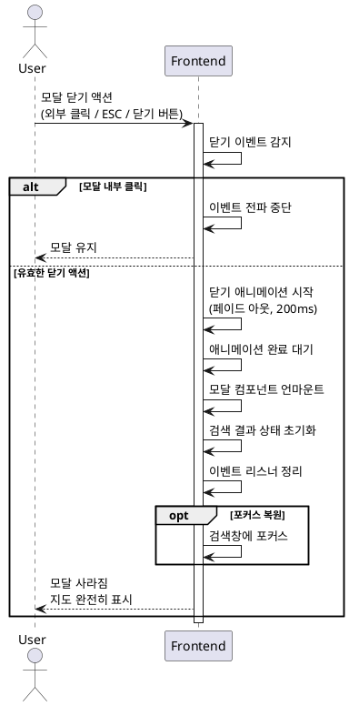

# UC-006: 검색 결과 모달 닫기

## Primary Actor
일반 사용자 (검색 결과를 확인한 후 모달을 닫고자 하는 사용자)

## Precondition
- 사용자가 메인 페이지에서 음식점 검색을 완료한 상태
- 검색 결과 모달이 화면에 표시되어 있음

## Trigger
사용자가 다음 중 하나의 액션을 수행:
- 모달 외부 영역(배경) 클릭
- ESC 키 입력
- 닫기 버튼 클릭 (존재하는 경우)

## Main Scenario

1. 사용자가 모달을 닫기 위한 액션을 수행한다
2. 시스템은 닫기 이벤트를 감지한다
3. 시스템은 모달 닫기 애니메이션을 시작한다 (페이드 아웃)
4. 시스템은 애니메이션 완료를 대기한다 (약 200ms)
5. 시스템은 모달 컴포넌트를 언마운트한다
6. 시스템은 검색 결과 데이터 상태를 초기화한다 (선택 사항)
7. 지도가 다시 완전히 보이게 된다
8. 검색창에 포커스가 복원된다 (선택 사항)

## Edge Cases

### 애니메이션 중 재클릭
- **원인**: 사용자가 모달 닫기 애니메이션 진행 중 다시 닫기 액션 수행
- **처리**: 중복 이벤트 무시, 진행 중인 애니메이션 완료 대기

### 모달 내부 클릭 시 버블링
- **원인**: 사용자가 모달 콘텐츠 영역을 클릭했으나 이벤트가 부모로 전파됨
- **처리**: 이벤트 전파 중단 (stopPropagation), 모달 닫히지 않도록 처리

### ESC 키 연속 입력
- **원인**: 사용자가 ESC 키를 빠르게 여러 번 누름
- **처리**: 첫 번째 입력만 처리, 이후 입력 무시

### 모달 닫기 중 리뷰 작성 버튼 클릭
- **원인**: 사용자가 모달 닫기 직전에 리뷰 작성 버튼 클릭
- **처리**: 리뷰 작성 액션 우선 처리, 모달 닫기 취소

### 키보드 이벤트 리스너 정리 실패
- **원인**: 컴포넌트 언마운트 시 이벤트 리스너가 제거되지 않음
- **처리**: useEffect cleanup 함수에서 명시적으로 이벤트 리스너 제거

## Business Rules

- BR-001: 모달 외부 영역 클릭 시 모달이 닫힌다
- BR-002: ESC 키 입력 시 모달이 즉시 닫힌다
- BR-003: 모달 내부 콘텐츠 클릭 시 모달이 닫히지 않는다
- BR-004: 모달 닫기 시 검색 결과 데이터는 메모리에서 해제된다
- BR-005: 모달 닫기 애니메이션은 200ms 이내로 완료된다

## Sequence Diagram

