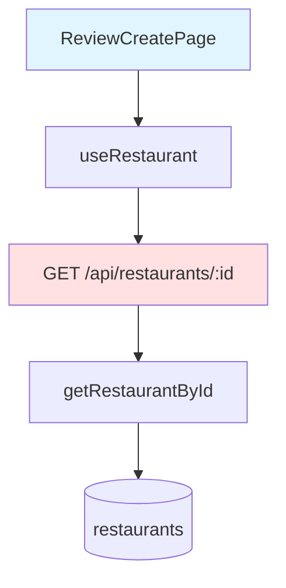

# Implementation Plan: UC-007 리뷰 작성 페이지 로드

## 개요

리뷰 작성 페이지 로드 및 음식점 정보 표시 기능을 구현합니다.

### 모듈 목록

| 모듈 | 위치 | 설명 |
|------|------|------|
| **GetRestaurant Schema** | `src/features/restaurant/backend/schema.ts` | 음식점 조회 스키마 |
| **getRestaurantById Service** | `src/features/restaurant/backend/service.ts` | 음식점 조회 로직 |
| **GET /api/restaurants/:id Route** | `src/features/restaurant/backend/route.ts` | 음식점 조회 엔드포인트 |
| **useRestaurant Hook** | `src/features/restaurant/hooks/useRestaurant.ts` | React Query 훅 |
| **ReviewCreatePage** | `src/app/review/create/page.tsx` | 리뷰 작성 페이지 |

---

## Diagram



---

## Implementation Plan

### 1. Backend Layer

#### Schema, Service, Route 구현 (UC-003과 유사)

```typescript
// Schema
export const GetRestaurantResponseSchema = z.object({
  id: z.string().uuid(),
  name: z.string(),
  address: z.string(),
  category: z.string().nullable(),
});

// Service
export const getRestaurantById = async (
  client: SupabaseClient,
  id: string,
): Promise<HandlerResult<GetRestaurantResponse, RestaurantServiceError>> => {
  const { data, error } = await client
    .from('restaurants')
    .select('id, name, address, category')
    .eq('id', id)
    .maybeSingle();

  if (error) {
    return failure(500, restaurantErrorCodes.fetchFailed, error.message);
  }

  if (!data) {
    return failure(404, restaurantErrorCodes.notFound, 'Restaurant not found');
  }

  return success(data);
};

// Route
app.get('/api/restaurants/:id', async (c) => {
  const id = c.req.param('id');
  // ... 구현
});
```

### 2. Frontend Layer

#### Page: `src/app/review/create/page.tsx`

```typescript
'use client';

import { useSearchParams, useRouter } from 'next/navigation';
import { useRestaurant } from '@/features/restaurant/hooks/useRestaurant';
import { Button } from '@/components/ui/button';
import { ArrowLeft } from 'lucide-react';

export default function ReviewCreatePage() {
  const router = useRouter();
  const searchParams = useSearchParams();
  const restaurantId = searchParams.get('restaurantId');

  const { data: restaurant, isLoading, error } = useRestaurant(restaurantId ?? '');

  if (!restaurantId) {
    router.replace('/');
    return null;
  }

  if (isLoading) {
    return <div>로딩 중...</div>;
  }

  if (error || !restaurant) {
    return <div>음식점 정보를 불러올 수 없습니다.</div>;
  }

  return (
    <main className="mx-auto max-w-2xl p-6">
      <Button variant="ghost" onClick={() => router.back()}>
        <ArrowLeft className="mr-2 h-4 w-4" />
        뒤로가기
      </Button>

      <div className="mt-6 space-y-2">
        <h1 className="text-2xl font-bold">{restaurant.name}</h1>
        <p className="text-slate-600">{restaurant.address}</p>
        {restaurant.category && (
          <p className="text-sm text-slate-500">{restaurant.category}</p>
        )}
      </div>

      {/* 리뷰 작성 폼은 UC-008에서 구현 */}
    </main>
  );
}
```

### 3. QA Sheet

- ✅ restaurantId 파라미터 추출
- ✅ 음식점 정보 조회 및 표시
- ✅ 로딩 상태 표시
- ✅ 에러 처리
- ✅ ID 누락 시 메인 페이지로 리다이렉트

### 4. 의존성

- **선행 작업**: UC-003
- **후속 작업**: UC-008 (리뷰 작성 폼)

