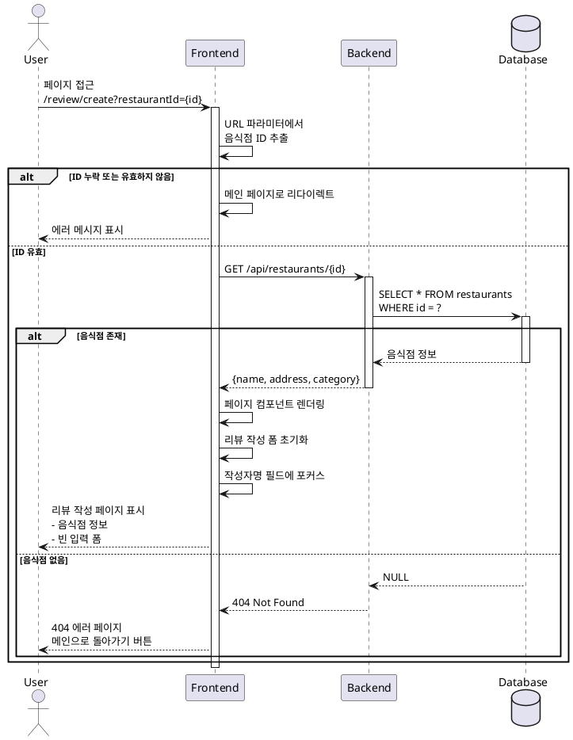

# UC-007: 리뷰 작성 페이지 로드

## Primary Actor
일반 사용자 (음식점에 대한 리뷰를 작성하고자 하는 사용자)

## Precondition
- 사용자가 검색 결과 또는 음식점 세부 정보 페이지에서 리뷰 작성 버튼을 클릭한 상태
- 리뷰를 작성할 음식점이 데이터베이스에 존재함

## Trigger
사용자가 리뷰 작성 페이지 URL로 접근 (`/review/create?restaurantId={id}`)

## Main Scenario

1. 사용자가 리뷰 작성 페이지 URL로 접근한다
2. 시스템은 URL 쿼리 파라미터에서 음식점 ID를 추출한다
3. 시스템은 음식점 ID의 유효성을 검사한다
4. 시스템은 음식점 상세 정보 API를 호출한다 (`GET /api/restaurants/{id}`)
5. 시스템은 응답 데이터를 파싱한다:
   - 음식점 이름
   - 전체 주소
   - 음식 카테고리
6. 시스템은 페이지 컴포넌트를 렌더링한다
7. 시스템은 리뷰 작성 폼을 초기화한다
8. 시스템은 작성자명 입력 필드에 포커스를 설정한다
9. 사용자에게 리뷰 작성 폼이 표시된다

## Edge Cases

### 음식점 ID 누락
- **원인**: URL에 restaurantId 쿼리 파라미터가 없음
- **처리**: 메인 페이지로 리다이렉트, 에러 메시지 토스트 표시

### 유효하지 않은 ID 형식
- **원인**: restaurantId가 UUID 형식이 아님
- **처리**: 404 에러 페이지 표시, 메인 페이지로 돌아가기 버튼 제공

### 음식점 정보 조회 실패
- **원인**: 네트워크 에러, API 타임아웃, 서버 오류
- **처리**: 에러 메시지 표시, 재시도 버튼 제공, 뒤로가기 버튼 활성화

### 음식점이 DB에 존재하지 않음
- **원인**: 음식점이 삭제되었거나 잘못된 ID
- **처리**: 404 에러 메시지 표시, 메인 페이지로 리다이렉트 유도

### API 응답 데이터 불완전
- **원인**: 음식점 이름 또는 주소 정보 누락
- **처리**: 사용 가능한 정보만 표시, 누락된 필드는 "정보 없음" 표시

### 브라우저 뒤로가기로 재진입
- **원인**: 사용자가 브라우저 뒤로가기 버튼으로 리뷰 작성 페이지 재방문
- **처리**: 폼 상태 초기화, 이전 입력 데이터 복원하지 않음

## Business Rules

- BR-001: 음식점 ID는 필수 파라미터이며, 누락 시 페이지 로드를 중단한다
- BR-002: 음식점 정보 조회 실패 시 리뷰 작성을 진행할 수 없다
- BR-003: 페이지 로드 시 모든 입력 필드는 빈 상태로 초기화된다
- BR-004: 작성자명 필드에 자동으로 포커스가 설정된다
- BR-005: 리뷰 작성하기 버튼은 초기에 비활성화 상태이다

## Sequence Diagram

