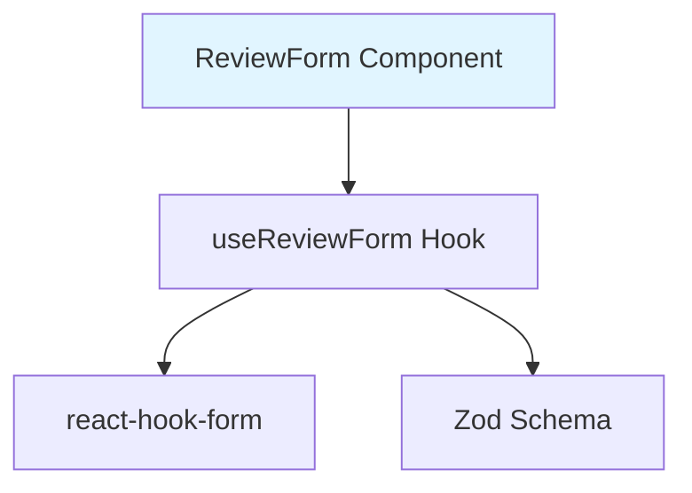

# Implementation Plan: UC-008 리뷰 작성 폼 입력

## 개요

리뷰 작성 폼의 실시간 입력 검증 및 상태 관리 기능을 구현합니다.

### 모듈 목록

| 모듈 | 위치 | 설명 |
|------|------|------|
| **ReviewForm Component** | `src/features/review/components/review-form.tsx` | 리뷰 작성 폼 컴포넌트 |
| **useReviewForm Hook** | `src/features/review/hooks/useReviewForm.ts` | 폼 상태 관리 훅 |
| **ReviewFormSchema** | `src/features/review/lib/validation.ts` | 클라이언트 측 유효성 검사 스키마 |

---

## Diagram



---

## Implementation Plan

### 1. Validation Schema: `src/features/review/lib/validation.ts`

```typescript
import { z } from 'zod';

export const ReviewFormSchema = z.object({
  author_name: z
    .string()
    .min(1, '작성자명을 입력해주세요')
    .max(20, '작성자명은 최대 20자까지 입력 가능합니다')
    .refine((val) => val.trim().length > 0, '공백만 입력할 수 없습니다'),
  rating: z
    .number()
    .int()
    .min(1, '평점을 선택해주세요')
    .max(5, '평점은 1~5 사이여야 합니다'),
  content: z
    .string()
    .min(10, '리뷰 내용은 최소 10자 이상 입력해주세요')
    .max(500, '리뷰 내용은 최대 500자까지 입력 가능합니다')
    .refine((val) => val.trim().length >= 10, '공백을 제외하고 최소 10자 이상 입력해주세요'),
  password: z
    .string()
    .min(4, '비밀번호는 최소 4자 이상 입력해주세요'),
});

export type ReviewFormData = z.infer<typeof ReviewFormSchema>;
```

### 2. Component: `src/features/review/components/review-form.tsx`

```typescript
'use client';

import { useState } from 'react';
import { useForm } from 'react-hook-form';
import { zodResolver } from '@hookform/resolvers/zod';
import { Star } from 'lucide-react';
import { Button } from '@/components/ui/button';
import { Input } from '@/components/ui/input';
import { Textarea } from '@/components/ui/textarea';
import { Label } from '@/components/ui/label';
import { ReviewFormSchema, type ReviewFormData } from '@/features/review/lib/validation';

type ReviewFormProps = {
  onSubmit: (data: ReviewFormData) => Promise<void>;
  isSubmitting: boolean;
};

export const ReviewForm = ({ onSubmit, isSubmitting }: ReviewFormProps) => {
  const [hoveredRating, setHoveredRating] = useState(0);

  const {
    register,
    handleSubmit,
    watch,
    setValue,
    formState: { errors, isValid },
  } = useForm<ReviewFormData>({
    resolver: zodResolver(ReviewFormSchema),
    mode: 'onChange',
    defaultValues: {
      author_name: '',
      rating: 0,
      content: '',
      password: '',
    },
  });

  const rating = watch('rating');
  const content = watch('content');

  return (
    <form onSubmit={handleSubmit(onSubmit)} className="space-y-6">
      {/* 작성자명 */}
      <div className="space-y-2">
        <Label htmlFor="author_name">작성자명</Label>
        <Input
          id="author_name"
          {...register('author_name')}
          maxLength={20}
          placeholder="이름을 입력하세요"
        />
        {errors.author_name && (
          <p className="text-sm text-red-500">{errors.author_name.message}</p>
        )}
      </div>

      {/* 평점 */}
      <div className="space-y-2">
        <Label>평점</Label>
        <div className="flex gap-1">
          {[1, 2, 3, 4, 5].map((star) => (
            <button
              key={star}
              type="button"
              onClick={() => setValue('rating', star, { shouldValidate: true })}
              onMouseEnter={() => setHoveredRating(star)}
              onMouseLeave={() => setHoveredRating(0)}
              className="transition-transform hover:scale-110"
            >
              <Star
                className={`h-8 w-8 ${
                  star <= (hoveredRating || rating)
                    ? 'fill-yellow-400 text-yellow-400'
                    : 'text-slate-300'
                }`}
              />
            </button>
          ))}
        </div>
        {errors.rating && (
          <p className="text-sm text-red-500">{errors.rating.message}</p>
        )}
      </div>

      {/* 리뷰 내용 */}
      <div className="space-y-2">
        <Label htmlFor="content">리뷰 내용</Label>
        <Textarea
          id="content"
          {...register('content')}
          maxLength={500}
          rows={5}
          placeholder="음식점에 대한 솔직한 리뷰를 작성해주세요 (최소 10자)"
        />
        <div className="flex justify-between text-sm">
          {errors.content && (
            <p className="text-red-500">{errors.content.message}</p>
          )}
          <p className="ml-auto text-slate-500">
            {content.length} / 500자
          </p>
        </div>
      </div>

      {/* 비밀번호 */}
      <div className="space-y-2">
        <Label htmlFor="password">비밀번호</Label>
        <Input
          id="password"
          type="password"
          {...register('password')}
          placeholder="리뷰 수정/삭제 시 사용됩니다 (최소 4자)"
        />
        {errors.password && (
          <p className="text-sm text-red-500">{errors.password.message}</p>
        )}
      </div>

      {/* 제출 버튼 */}
      <Button
        type="submit"
        disabled={!isValid || isSubmitting}
        className="w-full"
      >
        {isSubmitting ? '등록 중...' : '리뷰 작성하기'}
      </Button>
    </form>
  );
};
```

### 3. QA Sheet

- ✅ 실시간 유효성 검사
- ✅ 문자 수 카운팅 및 표시
- ✅ 별점 선택 UI (호버 효과)
- ✅ 에러 메시지 표시
- ✅ 버튼 활성화/비활성화
- ✅ 최대 길이 제한

### 4. 의존성

- **선행 작업**: UC-007
- **후속 작업**: UC-009 (리뷰 제출)

