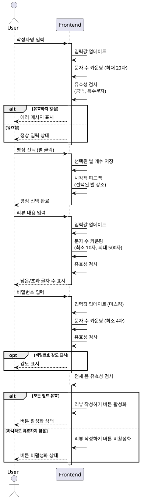

# UC-008: 리뷰 작성 폼 입력

## Primary Actor
일반 사용자 (리뷰 작성 폼에 정보를 입력하는 사용자)

## Precondition
- 사용자가 리뷰 작성 페이지에 접속한 상태
- 리뷰 작성 폼이 화면에 표시되어 있음
- 모든 입력 필드가 빈 상태로 초기화되어 있음

## Trigger
사용자가 리뷰 작성 폼의 각 필드에 데이터를 입력

## Main Scenario

### 작성자명 입력
1. 사용자가 작성자명 입력 필드에 텍스트를 입력한다
2. 시스템은 입력값을 실시간으로 업데이트한다
3. 시스템은 문자 수를 카운팅한다 (최대 20자)
4. 시스템은 실시간 유효성 검사를 수행한다:
   - 공백만 있는지 확인
   - 특수문자 제한 확인 (선택 사항)
5. 시스템은 유효성 검사 결과에 따라 에러 메시지를 표시하거나 숨긴다

### 평점 선택
1. 사용자가 별 아이콘 중 하나를 클릭한다
2. 시스템은 클릭 이벤트를 감지한다
3. 시스템은 선택된 별 개수 (1~5)를 저장한다
4. 시스템은 선택된 별까지 시각적으로 강조 표시한다

### 리뷰 내용 입력
1. 사용자가 리뷰 내용 텍스트 영역에 텍스트를 입력한다
2. 시스템은 입력값을 실시간으로 업데이트한다
3. 시스템은 문자 수를 카운팅한다 (최소 10자, 최대 500자)
4. 시스템은 실시간 유효성 검사를 수행한다
5. 시스템은 남은 글자 수 또는 초과 글자 수를 표시한다

### 비밀번호 입력
1. 사용자가 비밀번호 입력 필드에 텍스트를 입력한다
2. 시스템은 입력값을 실시간으로 업데이트한다 (마스킹 처리)
3. 시스템은 문자 수를 카운팅한다 (최소 4자)
4. 시스템은 실시간 유효성 검사를 수행한다
5. 시스템은 비밀번호 강도를 표시한다 (선택 사항)

### 전체 폼 유효성 검사
1. 시스템은 모든 필드의 유효성을 종합적으로 확인한다
2. 시스템은 리뷰 작성하기 버튼을 활성화하거나 비활성화한다

## Edge Cases

### 작성자명 20자 초과
- **원인**: 사용자가 20자를 초과하여 입력 시도
- **처리**: 20자까지만 입력 가능하도록 제한, 에러 메시지 표시

### 리뷰 내용 500자 초과
- **원인**: 사용자가 500자를 초과하여 입력 시도
- **처리**: 500자까지만 입력 가능하도록 제한, 초과 글자 수 표시

### 리뷰 내용 10자 미만
- **원인**: 사용자가 10자 미만으로 입력
- **처리**: 최소 글자 수 안내 메시지 표시, 버튼 비활성화 유지

### 비밀번호 4자 미만
- **원인**: 사용자가 4자 미만으로 입력
- **처리**: 최소 글자 수 안내 메시지 표시, 버튼 비활성화 유지

### 평점 미선택
- **원인**: 사용자가 평점을 선택하지 않음
- **처리**: 평점 선택 필수 안내 표시, 버튼 비활성화 유지

### 공백만 입력
- **원인**: 사용자가 공백 문자만 입력
- **처리**: 유효하지 않은 입력으로 간주, 에러 메시지 표시

### 특수문자 입력 (선택 사항)
- **원인**: 사용자가 허용되지 않는 특수문자 입력
- **처리**: 해당 문자 입력 방지, 안내 메시지 표시

### 복사-붙여넣기로 긴 텍스트 입력
- **원인**: 사용자가 최대 길이를 초과하는 텍스트를 붙여넣기
- **처리**: 최대 길이까지만 잘라서 입력, 초과 부분 제거 안내

## Business Rules

- BR-001: 작성자명은 1~20자 범위 내에서 입력 가능하다
- BR-002: 평점은 1~5점 중 하나를 필수로 선택해야 한다
- BR-003: 리뷰 내용은 10~500자 범위 내에서 입력 가능하다
- BR-004: 비밀번호는 4자 이상 입력해야 한다
- BR-005: 모든 필드가 유효한 경우에만 리뷰 작성하기 버튼이 활성화된다
- BR-006: 공백만 있는 입력은 유효하지 않은 것으로 간주한다
- BR-007: 문자 수 카운팅은 trim 처리 후 수행한다

## Sequence Diagram

