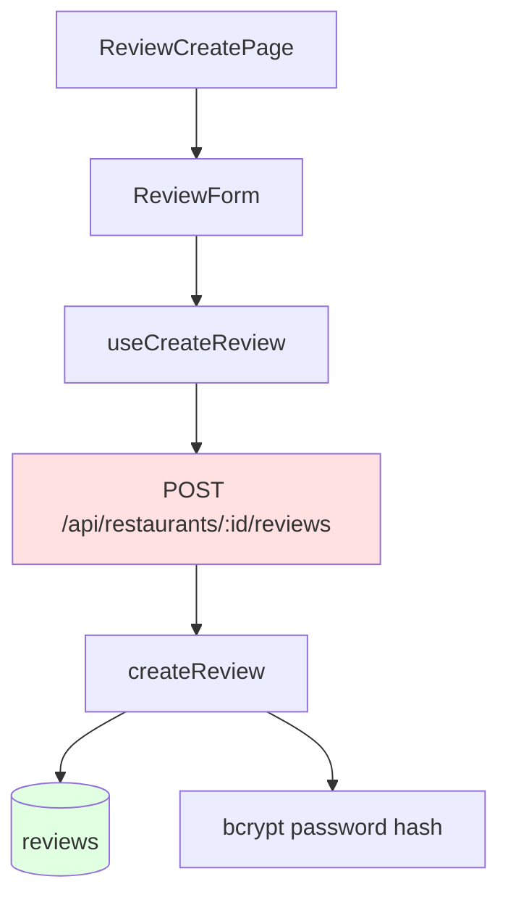

# Implementation Plan: UC-009 리뷰 작성 제출

## 개요

리뷰 작성 제출 및 음식점 세부 정보 페이지로 리다이렉트하는 기능을 구현합니다.

### 모듈 목록

| 모듈 | 위치 | 설명 |
|------|------|------|
| **CreateReview Schema** | `src/features/review/backend/schema.ts` | 리뷰 생성 스키마 |
| **createReview Service** | `src/features/review/backend/service.ts` | 리뷰 생성 로직 |
| **POST /api/restaurants/:id/reviews Route** | `src/features/review/backend/route.ts` | 리뷰 생성 엔드포인트 |
| **useCreateReview Hook** | `src/features/review/hooks/useCreateReview.ts` | React Query mutation |
| **ReviewCreatePage** | `src/app/review/create/page.tsx` | 폼 제출 핸들러 추가 |

---

## Diagram



---

## Implementation Plan

### 1. Backend Layer

#### Schema: `src/features/review/backend/schema.ts`

```typescript
export const CreateReviewRequestSchema = z.object({
  author_name: z.string().min(1).max(20),
  rating: z.number().int().min(1).max(5),
  content: z.string().min(10).max(500),
  password: z.string().min(4),
});

export const CreateReviewResponseSchema = z.object({
  id: z.string().uuid(),
  restaurant_id: z.string().uuid(),
  author_name: z.string(),
  rating: z.number(),
  content: z.string(),
  created_at: z.string(),
});
```

#### Service: `src/features/review/backend/service.ts`

```typescript
import bcrypt from 'bcrypt';

const SALT_ROUNDS = 10;

export const createReview = async (
  client: SupabaseClient,
  restaurantId: string,
  data: CreateReviewRequest,
): Promise<HandlerResult<CreateReviewResponse, ReviewServiceError>> => {
  // 비밀번호 해싱
  const passwordHash = await bcrypt.hash(data.password, SALT_ROUNDS);

  const { data: created, error } = await client
    .from('reviews')
    .insert({
      restaurant_id: restaurantId,
      author_name: data.author_name.trim(),
      rating: data.rating,
      content: data.content.trim(),
      password_hash: passwordHash,
    })
    .select()
    .single();

  if (error) {
    return failure(500, reviewErrorCodes.createFailed, error.message);
  }

  return success(created);
};
```

#### Route: `src/features/review/backend/route.ts`

```typescript
export const registerReviewRoutes = (app: Hono<AppEnv>) => {
  app.post('/api/restaurants/:restaurantId/reviews', async (c) => {
    const restaurantId = c.req.param('restaurantId');
    const body = await c.req.json();
    
    const parsedBody = CreateReviewRequestSchema.safeParse(body);
    if (!parsedBody.success) {
      return respond(c, failure(400, 'INVALID_REQUEST', 'Invalid review data'));
    }

    const supabase = getSupabase(c);
    const result = await createReview(supabase, restaurantId, parsedBody.data);

    return respond(c, result);
  });
};
```

### 2. Frontend Layer

#### Hook: `src/features/review/hooks/useCreateReview.ts`

```typescript
export const useCreateReview = (restaurantId: string) => {
  const router = useRouter();
  const { toast } = useToast();
  const queryClient = useQueryClient();

  return useMutation({
    mutationFn: async (data: ReviewFormData) => {
      const { data: response } = await apiClient.post(
        `/api/restaurants/${restaurantId}/reviews`,
        data,
      );
      return CreateReviewResponseSchema.parse(response);
    },
    onSuccess: () => {
      toast({
        title: '리뷰가 등록되었습니다',
        description: '소중한 의견 감사합니다!',
      });

      // 캐시 무효화
      queryClient.invalidateQueries({ queryKey: ['restaurants', restaurantId] });
      queryClient.invalidateQueries({ queryKey: ['restaurants', 'markers'] });

      // 음식점 세부 정보 페이지로 이동
      router.push(`/restaurant/${restaurantId}`);
    },
    onError: (error) => {
      toast({
        variant: 'destructive',
        title: '리뷰 등록 실패',
        description: error.message,
      });
    },
  });
};
```

### 3. QA Sheet

- ✅ 리뷰 생성 API 호출
- ✅ 비밀번호 해싱
- ✅ 성공 시 리다이렉트
- ✅ 실패 시 에러 토스트
- ✅ 중복 제출 방지

### 4. 의존성

- **선행 작업**: UC-008
- **후속 작업**: UC-011, UC-020
- **패키지**: bcrypt 설치 필요

