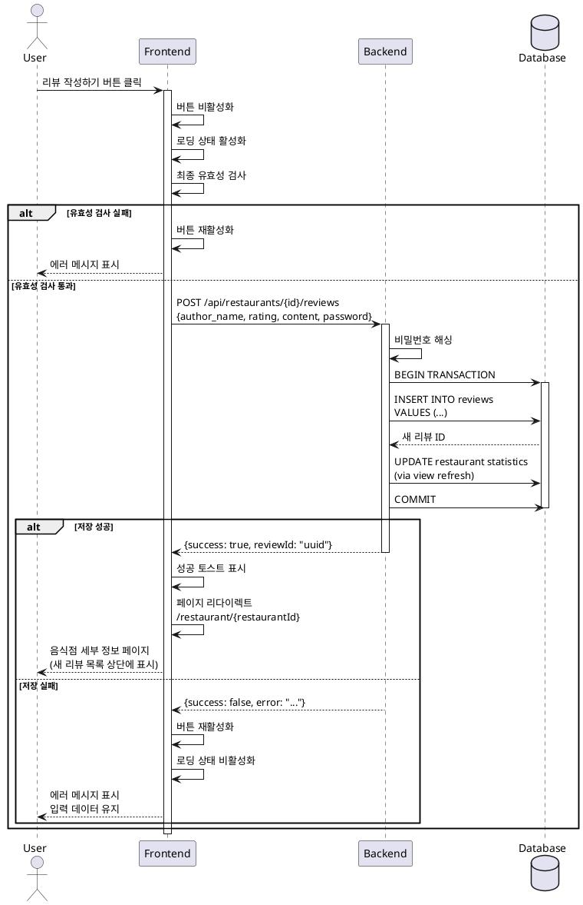

# UC-009: 리뷰 작성 제출

## Primary Actor
일반 사용자 (작성한 리뷰를 제출하고자 하는 사용자)

## Precondition
- 사용자가 리뷰 작성 페이지에서 모든 필드를 유효하게 입력한 상태
- 리뷰 작성하기 버튼이 활성화되어 있음

## Trigger
사용자가 리뷰 작성하기 버튼을 클릭

## Main Scenario

1. 사용자가 리뷰 작성하기 버튼을 클릭한다
2. 시스템은 버튼을 비활성화하여 중복 제출을 방지한다
3. 시스템은 로딩 상태를 활성화한다 (로딩 스피너 표시)
4. 시스템은 폼 데이터의 최종 유효성 검사를 수행한다:
   - 작성자명: 1~20자, 공백 아님
   - 평점: 1~5 범위
   - 리뷰 내용: 10~500자, 공백 아님
   - 비밀번호: 4자 이상
5. 유효성 검사 통과 시, 시스템은 리뷰 작성 API를 호출한다 (`POST /api/restaurants/{restaurantId}/reviews`)
6. 백엔드는 비밀번호를 해싱 처리한다
7. 백엔드는 리뷰 데이터를 데이터베이스에 저장한다
8. 백엔드는 음식점의 평균 평점과 리뷰 개수를 업데이트한다
9. 백엔드는 생성된 리뷰 ID를 포함한 성공 응답을 반환한다
10. 시스템은 성공 토스트 메시지를 표시한다
11. 시스템은 음식점 세부 정보 페이지로 자동 리다이렉트한다 (`/restaurant/{restaurantId}`)
12. 새로 작성된 리뷰가 목록 상단에 표시된다

## Edge Cases

### 유효성 검사 실패
- **원인**: 클라이언트 측 검증을 우회하거나 데이터 변조
- **처리**: 구체적인 에러 메시지 표시, 해당 필드에 포커스, 버튼 재활성화

### 네트워크 에러
- **원인**: 인터넷 연결 끊김, API 서버 다운, 타임아웃 (30초)
- **처리**: 에러 토스트 표시, 재시도 버튼 제공, 입력 데이터 유지

### 서버 에러 (500)
- **원인**: 서버 내부 오류, 데이터베이스 연결 실패
- **처리**: 일시적 오류 안내, 재시도 유도, 데이터 유지

### 중복 제출 시도
- **원인**: 사용자가 버튼을 빠르게 여러 번 클릭
- **처리**: 버튼 비활성화로 방지, 이미 제출 중 메시지 표시

### 음식점 존재하지 않음 (404)
- **원인**: 리뷰 작성 중 음식점이 삭제됨
- **처리**: 음식점 삭제됨 안내, 메인 페이지로 리다이렉트

### 데이터 형식 오류 (400)
- **원인**: 서버 측 검증 실패, 잘못된 데이터 형식
- **처리**: 서버 검증 메시지 표시, 해당 필드 수정 유도

### 비밀번호 해싱 실패
- **원인**: 해싱 라이브러리 오류, 메모리 부족
- **처리**: 에러 로깅, 재시도 로직, 사용자에게 일시적 오류 안내

### 리다이렉트 실패
- **원인**: 라우터 오류, 잘못된 URL 생성
- **처리**: 현재 페이지 유지, 성공 메시지 표시, 수동 이동 버튼 제공

## Business Rules

- BR-001: 리뷰 작성 시 모든 필드는 필수 입력 사항이다
- BR-002: 비밀번호는 bcrypt 등의 안전한 해싱 알고리즘으로 암호화하여 저장한다
- BR-003: 리뷰 작성 성공 시 음식점의 평균 평점과 리뷰 개수가 자동으로 업데이트된다
- BR-004: 리뷰 작성 후 자동으로 음식점 세부 정보 페이지로 이동한다
- BR-005: 새로 작성된 리뷰는 목록 최상단에 표시된다
- BR-006: 리뷰 작성 실패 시 입력한 데이터는 유지되어 재시도가 가능하다

## Sequence Diagram

