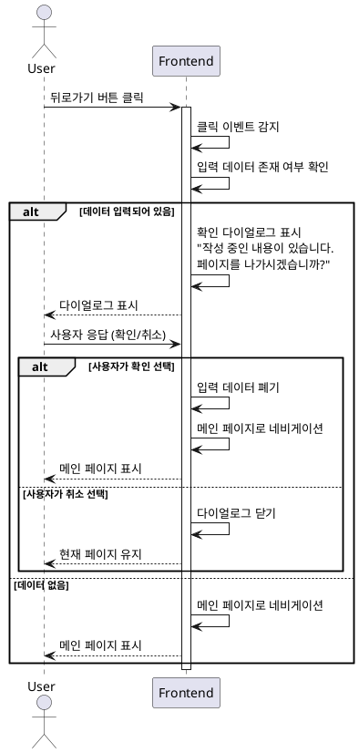

# UC-010: 뒤로가기 버튼 클릭 (리뷰 작성 페이지)

## Primary Actor
일반 사용자 (리뷰 작성을 취소하고 이전 페이지로 돌아가고자 하는 사용자)

## Precondition
- 사용자가 리뷰 작성 페이지에 접속한 상태
- 페이지 헤더에 뒤로가기 버튼이 표시되어 있음

## Trigger
사용자가 리뷰 작성 페이지 헤더의 뒤로가기 버튼을 클릭

## Main Scenario

1. 사용자가 뒤로가기 버튼을 클릭한다
2. 시스템은 클릭 이벤트를 감지한다
3. 시스템은 입력 중인 데이터 존재 여부를 확인한다
4. **데이터가 입력되어 있는 경우:**
   - 시스템은 확인 다이얼로그를 표시한다 ("작성 중인 내용이 있습니다. 페이지를 나가시겠습니까?")
   - 시스템은 사용자 응답을 대기한다
   - 사용자가 확인을 선택하면 네비게이션을 진행한다
   - 사용자가 취소를 선택하면 현재 페이지를 유지한다
5. **데이터가 없는 경우:**
   - 시스템은 즉시 메인 페이지로 네비게이션한다
6. 브라우저 히스토리 백을 실행하거나 메인 페이지로 직접 라우팅한다
7. 메인 페이지가 표시된다

## Edge Cases

### 데이터 입력 중
- **원인**: 사용자가 일부 필드에 데이터를 입력한 상태
- **처리**: 데이터 손실 경고 다이얼로그 표시, 사용자 의사 확인

### 확인 다이얼로그 무시
- **원인**: 사용자가 ESC 키나 외부 클릭으로 다이얼로그 닫기
- **처리**: 취소로 간주, 현재 페이지 유지

### 브라우저 뒤로가기 버튼 사용
- **원인**: 사용자가 브라우저 자체의 뒤로가기 버튼 클릭
- **처리**: beforeunload 이벤트 핸들링, 브라우저 기본 경고 메시지 표시

### 리뷰 작성 중 뒤로가기
- **원인**: 사용자가 리뷰 제출 API 호출 중 뒤로가기 시도
- **처리**: API 호출 취소, 확인 다이얼로그 표시

### 네비게이션 실패
- **원인**: 라우터 오류, 잘못된 URL
- **처리**: 에러 핸들링, 현재 페이지 유지, 에러 메시지 표시

### 입력 데이터 판단 기준
- **원인**: 공백만 입력된 경우 데이터로 간주할지 여부
- **처리**: trim 후 빈 문자열이면 데이터 없음으로 간주

## Business Rules

- BR-001: 입력 중인 데이터가 있을 경우 사용자에게 확인을 요청한다
- BR-002: 데이터가 없을 경우 즉시 메인 페이지로 이동한다
- BR-003: 뒤로가기 시 입력 중이던 데이터는 모두 폐기된다
- BR-004: 브라우저 뒤로가기 버튼도 동일한 확인 프로세스를 거친다
- BR-005: 메인 페이지로 이동 시 브라우저 히스토리가 업데이트된다

## Sequence Diagram

