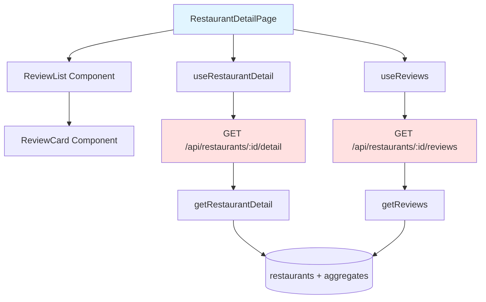

# Implementation Plan: UC-011 음식점 세부 정보 페이지 로드

## 개요

음식점 세부 정보 및 리뷰 목록을 표시하는 페이지를 구현합니다.

### 모듈 목록

| 모듈 | 위치 | 설명 |
|------|------|------|
| **GetRestaurantDetail Schema** | `src/features/restaurant/backend/schema.ts` | 상세 정보 스키마 |
| **GetReviews Schema** | `src/features/review/backend/schema.ts` | 리뷰 목록 스키마 |
| **getRestaurantDetail Service** | `src/features/restaurant/backend/service.ts` | 상세 정보 조회 |
| **getReviews Service** | `src/features/review/backend/service.ts` | 리뷰 목록 조회 |
| **GET /api/restaurants/:id/detail Route** | `src/features/restaurant/backend/route.ts` | 상세 정보 엔드포인트 |
| **GET /api/restaurants/:id/reviews Route** | `src/features/review/backend/route.ts` | 리뷰 목록 엔드포인트 |
| **useRestaurantDetail Hook** | `src/features/restaurant/hooks/useRestaurantDetail.ts` | React Query 훅 |
| **useReviews Hook** | `src/features/review/hooks/useReviews.ts` | React Query 훅 |
| **RestaurantDetailPage** | `src/app/restaurant/[restaurantId]/page.tsx` | 상세 페이지 |
| **ReviewList Component** | `src/features/review/components/review-list.tsx` | 리뷰 목록 컴포넌트 |
| **ReviewCard Component** | `src/features/review/components/review-card.tsx` | 리뷰 카드 컴포넌트 |

---

## Diagram



---

## Implementation Plan

### 1. Backend Layer

#### Schema: `src/features/restaurant/backend/schema.ts`

```typescript
export const GetRestaurantDetailResponseSchema = z.object({
  id: z.string().uuid(),
  name: z.string(),
  address: z.string(),
  category: z.string().nullable(),
  average_rating: z.number().nullable(),
  review_count: z.number().int(),
});
```

#### Service: `src/features/restaurant/backend/service.ts`

```typescript
export const getRestaurantDetail = async (
  client: SupabaseClient,
  id: string,
): Promise<HandlerResult<GetRestaurantDetailResponse, RestaurantServiceError>> => {
  const { data, error } = await client
    .from('restaurants')
    .select(`
      *,
      aggregates:restaurant_review_aggregates(review_count, average_rating)
    `)
    .eq('id', id)
    .maybeSingle();

  if (error) {
    return failure(500, restaurantErrorCodes.fetchFailed, error.message);
  }

  if (!data) {
    return failure(404, restaurantErrorCodes.notFound, 'Restaurant not found');
  }

  return success({
    ...data,
    review_count: data.aggregates?.review_count ?? 0,
    average_rating: data.aggregates?.average_rating ?? null,
  });
};
```

#### Schema: `src/features/review/backend/schema.ts`

```typescript
export const ReviewSchema = z.object({
  id: z.string().uuid(),
  author_name: z.string(),
  rating: z.number().int().min(1).max(5),
  content: z.string(),
  created_at: z.string(),
});

export const GetReviewsResponseSchema = z.array(ReviewSchema);
```

#### Service: `src/features/review/backend/service.ts`

```typescript
export const getReviews = async (
  client: SupabaseClient,
  restaurantId: string,
  limit = 10,
  offset = 0,
): Promise<HandlerResult<Review[], ReviewServiceError>> => {
  const { data, error } = await client
    .from('reviews')
    .select('id, author_name, rating, content, created_at')
    .eq('restaurant_id', restaurantId)
    .order('created_at', { ascending: false })
    .range(offset, offset + limit - 1);

  if (error) {
    return failure(500, reviewErrorCodes.fetchFailed, error.message);
  }

  return success(data ?? []);
};
```

### 2. Frontend Layer

#### Page: `src/app/restaurant/[restaurantId]/page.tsx`

```typescript
'use client';

import { use } from 'react';
import { useRouter } from 'next/navigation';
import { Button } from '@/components/ui/button';
import { ArrowLeft, Star } from 'lucide-react';
import { useRestaurantDetail } from '@/features/restaurant/hooks/useRestaurantDetail';
import { useReviews } from '@/features/review/hooks/useReviews';
import { ReviewList } from '@/features/review/components/review-list';

type RestaurantDetailPageProps = {
  params: Promise<{ restaurantId: string }>;
};

export default function RestaurantDetailPage({ params }: RestaurantDetailPageProps) {
  const { restaurantId } = use(params);
  const router = useRouter();

  const { data: restaurant, isLoading: isLoadingRestaurant } = useRestaurantDetail(restaurantId);
  const { data: reviews, isLoading: isLoadingReviews } = useReviews(restaurantId);

  if (isLoadingRestaurant) {
    return <div>로딩 중...</div>;
  }

  if (!restaurant) {
    return <div>음식점을 찾을 수 없습니다.</div>;
  }

  return (
    <main className="mx-auto max-w-4xl p-6">
      <Button variant="ghost" onClick={() => router.back()}>
        <ArrowLeft className="mr-2 h-4 w-4" />
        뒤로가기
      </Button>

      <div className="mt-6 space-y-4">
        <h1 className="text-3xl font-bold">{restaurant.name}</h1>
        <p className="text-slate-600">{restaurant.address}</p>
        {restaurant.category && (
          <p className="text-sm text-slate-500">{restaurant.category}</p>
        )}

        <div className="flex items-center gap-4">
          {restaurant.average_rating !== null && (
            <div className="flex items-center gap-2">
              <Star className="h-5 w-5 fill-yellow-400 text-yellow-400" />
              <span className="text-lg font-semibold">
                {restaurant.average_rating.toFixed(1)}
              </span>
            </div>
          )}
          <span className="text-slate-600">
            {restaurant.review_count}개의 리뷰
          </span>
        </div>

        <Button
          onClick={() => router.push(`/review/create?restaurantId=${restaurantId}`)}
          className="w-full"
        >
          리뷰 작성하기
        </Button>
      </div>

      <div className="mt-8">
        <h2 className="mb-4 text-2xl font-bold">리뷰</h2>
        {isLoadingReviews ? (
          <div>리뷰 로딩 중...</div>
        ) : (
          <ReviewList reviews={reviews ?? []} />
        )}
      </div>
    </main>
  );
}
```

#### Component: `src/features/review/components/review-card.tsx`

```typescript
'use client';

import { Star } from 'lucide-react';
import { format } from 'date-fns';
import type { Review } from '@/features/review/lib/dto';

type ReviewCardProps = {
  review: Review;
};

export const ReviewCard = ({ review }: ReviewCardProps) => {
  return (
    <div className="rounded-lg border border-slate-200 bg-white p-4">
      <div className="flex items-start justify-between">
        <div>
          <p className="font-medium">{review.author_name}</p>
          <p className="text-sm text-slate-500">
            {format(new Date(review.created_at), 'yyyy.MM.dd')}
          </p>
        </div>
        <div className="flex items-center gap-1">
          {Array.from({ length: review.rating }).map((_, i) => (
            <Star key={i} className="h-4 w-4 fill-yellow-400 text-yellow-400" />
          ))}
        </div>
      </div>
      <p className="mt-3 text-slate-700">{review.content}</p>
    </div>
  );
};
```

### 3. QA Sheet

- ✅ 음식점 정보 표시
- ✅ 평균 평점 및 리뷰 개수 표시
- ✅ 리뷰 목록 최신순 정렬
- ✅ 리뷰 작성 버튼
- ✅ 병렬 API 호출
- ✅ 로딩 상태 처리

### 4. 의존성

- **선행 작업**: UC-009
- **후속 작업**: UC-012, UC-015
- **패키지**: date-fns (이미 설치됨)

