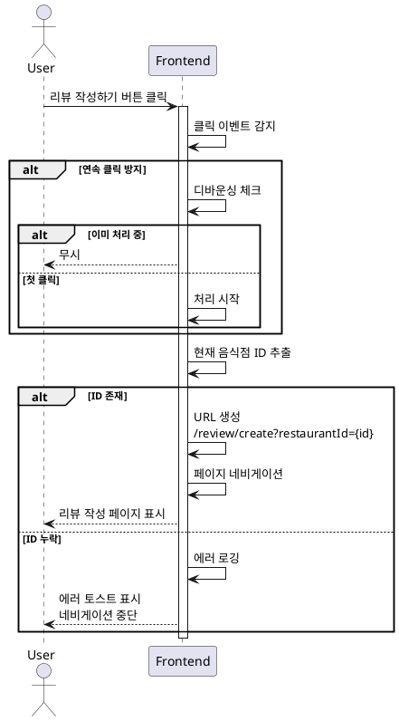

# UC-012: 음식점 세부 정보 페이지에서 리뷰 작성 버튼 클릭

## Primary Actor
일반 사용자 (음식점 세부 정보를 확인한 후 리뷰를 작성하고자 하는 사용자)

## Precondition
- 사용자가 음식점 세부 정보 페이지에 접속한 상태
- 페이지에 리뷰 작성하기 버튼이 표시되어 있음

## Trigger
사용자가 음식점 세부 정보 페이지의 리뷰 작성하기 버튼을 클릭

## Main Scenario

1. 사용자가 리뷰 작성하기 버튼을 클릭한다
2. 시스템은 버튼 클릭 이벤트를 감지한다
3. 시스템은 현재 페이지의 음식점 ID를 추출한다
4. 시스템은 리뷰 작성 페이지 URL을 생성한다 (`/review/create?restaurantId={id}`)
5. 시스템은 해당 URL로 페이지 네비게이션을 실행한다
6. 리뷰 작성 페이지가 표시된다

## Edge Cases

### 음식점 ID 누락
- **원인**: 페이지 상태 오류, 메모리 손상
- **처리**: 에러 로깅, 에러 토스트 표시, 네비게이션 중단

### 연속 클릭
- **원인**: 사용자가 버튼을 빠르게 여러 번 클릭
- **처리**: 디바운싱 적용 (300ms), 첫 클릭만 처리, 처리 중 버튼 비활성화

### 네비게이션 실패
- **원인**: 라우터 오류, 잘못된 URL 생성
- **처리**: 라우터 에러 핸들링, 현재 페이지 유지, 에러 메시지 표시

### 음식점 삭제 후 버튼 클릭
- **원인**: 페이지 로드 후 음식점이 삭제됨 (드문 경우)
- **처리**: 리뷰 작성 페이지에서 404 에러 처리, 메인 페이지로 리다이렉트

### 버튼 중복 렌더링
- **원인**: 컴포넌트 중복 마운트, 상태 관리 오류
- **처리**: 모든 버튼이 동일한 동작 수행, 디바운싱으로 중복 방지

## Business Rules

- BR-001: 리뷰 작성하기 버튼 클릭 시 리뷰 작성 페이지로 즉시 이동한다
- BR-002: 음식점 ID는 쿼리 파라미터로 전달된다
- BR-003: 페이지 전환 시 브라우저 히스토리에 새 엔트리가 추가된다
- BR-004: 음식점 정보는 리뷰 작성 페이지에서 재조회된다 (캐시 활용 가능)
- BR-005: 버튼은 페이지 내에서 눈에 띄게 배치되어야 한다

## Sequence Diagram

