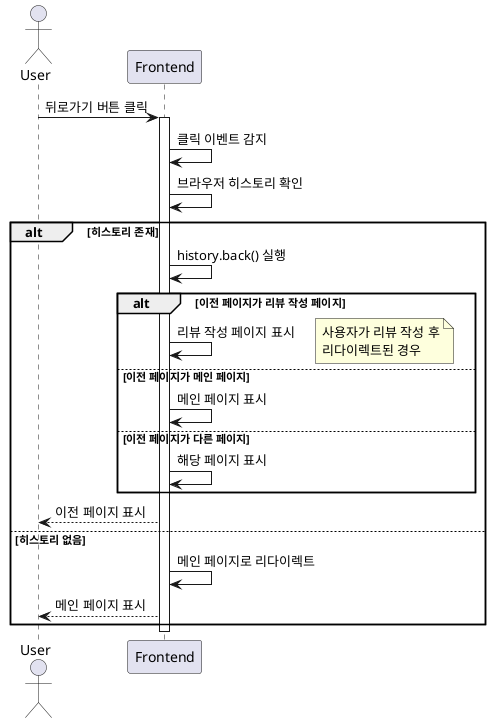

# UC-013: 뒤로가기 버튼 클릭 (음식점 세부 정보 페이지)

## Primary Actor
일반 사용자 (음식점 세부 정보 확인 후 이전 페이지로 돌아가고자 하는 사용자)

## Precondition
- 사용자가 음식점 세부 정보 페이지에 접속한 상태
- 페이지 헤더에 뒤로가기 버튼이 표시되어 있음

## Trigger
사용자가 음식점 세부 정보 페이지 헤더의 뒤로가기 버튼을 클릭

## Main Scenario

1. 사용자가 뒤로가기 버튼을 클릭한다
2. 시스템은 클릭 이벤트를 감지한다
3. 시스템은 브라우저 히스토리를 확인한다
4. **히스토리가 존재하는 경우:**
   - 시스템은 브라우저 뒤로가기를 실행한다 (history.back())
   - 이전 페이지로 이동한다
5. **히스토리가 없는 경우** (직접 URL 접근):
   - 시스템은 메인 페이지로 리다이렉트한다
6. 페이지 전환 애니메이션이 실행된다
7. 이전 페이지 또는 메인 페이지가 표시된다

## Edge Cases

### 외부 사이트에서 직접 접근
- **원인**: 다른 웹사이트 링크를 통해 음식점 세부 정보 페이지로 직접 접근
- **처리**: 히스토리 없음, 메인 페이지로 안전하게 이동

### 새 탭에서 열림
- **원인**: 사용자가 링크를 새 탭으로 열어 접근
- **처리**: 히스토리 없음, 메인 페이지로 이동

### 브라우저 뒤로가기 버튼 사용
- **원인**: 사용자가 브라우저 자체의 뒤로가기 버튼 클릭
- **처리**: 브라우저 기본 동작 수행, 히스토리 기반 이동

### 리뷰 작성 후 리다이렉트로 진입한 경우
- **원인**: 리뷰 작성 완료 후 자동 리다이렉트로 세부 정보 페이지 진입
- **처리**: 히스토리 존재, 리뷰 작성 페이지로 돌아가지 않고 그 이전 페이지로 이동

### 네비게이션 실패
- **원인**: 라우터 오류, 잘못된 URL
- **처리**: 에러 핸들링, 현재 페이지 유지, 에러 메시지 표시

### 히스토리 스택 깊이 확인 불가
- **원인**: 브라우저 보안 정책으로 히스토리 길이 확인 제한
- **처리**: history.back() 시도, 실패 시 메인 페이지로 폴백

## Business Rules

- BR-001: 브라우저 히스토리가 존재하면 이전 페이지로 이동한다
- BR-002: 히스토리가 없으면 메인 페이지로 이동한다
- BR-003: 페이지 전환 시 부드러운 애니메이션을 적용한다
- BR-004: 뒤로가기 시 페이지 상태는 보존되지 않는다 (새로 로드)
- BR-005: 리뷰 작성 페이지에서 온 경우 리뷰 작성 페이지를 건너뛴다

## Sequence Diagram

