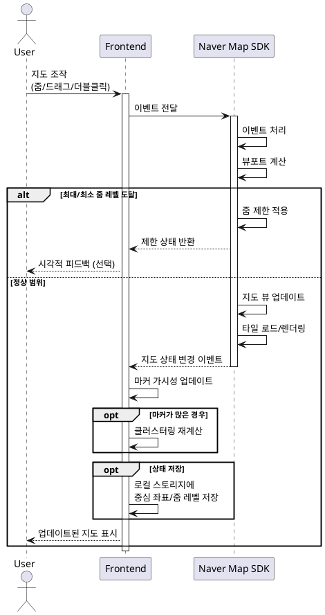

# UC-014: 지도 조작 (확대/축소/드래그)

## Primary Actor
일반 사용자 (지도를 탐색하며 원하는 지역의 맛집을 찾고자 하는 사용자)

## Precondition
- 사용자가 메인 페이지에 접속한 상태
- 네이버 지도가 정상적으로 로드되어 있음
- 지도 조작 기능이 활성화되어 있음

## Trigger
사용자가 지도를 조작:
- 마우스 휠로 줌 인/아웃
- 줌 컨트롤 버튼 클릭
- 지도 드래그하여 이동
- 더블클릭으로 줌 인
- 핀치 줌 (모바일)

## Main Scenario

1. 사용자가 지도 상호작용 액션을 수행한다
2. 시스템은 지도 상호작용 이벤트를 감지한다
3. 네이버 지도 SDK가 이벤트를 내부적으로 처리한다
4. 시스템은 지도 뷰포트를 변경한다
5. 시스템은 뷰포트 영역 내 마커의 가시성을 업데이트한다
6. 필요 시 마커 클러스터링을 재계산한다 (선택 사항)
7. 시스템은 지도 상태 변경 이벤트를 발생시킨다
8. 지도가 부드럽게 업데이트되어 사용자에게 표시된다

## Edge Cases

### 최대/최소 줌 레벨 도달
- **원인**: 사용자가 최대 또는 최소 줌 레벨에서 추가 줌 시도
- **처리**: 더 이상 줌 불가 상태 처리, 시각적 피드백 제공 (선택 사항)

### 지도 경계 밖으로 드래그
- **원인**: 사용자가 지도를 지나치게 드래그하여 유효 영역을 벗어남
- **처리**: SDK에서 자동 제한, 또는 경계 설정 (한국 지역만 등)

### 빠른 연속 조작
- **원인**: 사용자가 지도를 빠르게 확대/축소/드래그
- **처리**: 쓰로틀링 적용 (100ms), 성능 최적화

### 마커가 너무 많을 때
- **원인**: 현재 뷰포트에 수백 개의 마커가 표시됨
- **처리**: 클러스터링 자동 적용, 가시 영역만 렌더링

### 모바일에서 핀치 줌
- **원인**: 모바일 사용자가 두 손가락으로 핀치 제스처 수행
- **처리**: 네이버 지도 SDK가 자동 처리, 부드러운 줌 애니메이션

### 지도 로딩 중 조작 시도
- **원인**: 지도가 완전히 로드되기 전에 사용자가 조작 시도
- **처리**: 로딩 완료 후 이벤트 처리, 로딩 스피너 표시

### 네트워크 연결 끊김 중 조작
- **원인**: 지도 타일 로드 중 네트워크 연결 끊김
- **처리**: 캐시된 타일 표시, 연결 복구 시 자동 재로드

### 메모리 부족
- **원인**: 장시간 사용으로 메모리 누적
- **처리**: 뷰포트 밖 마커 언마운트, 타일 캐시 정리

## Business Rules

- BR-001: 지도 조작은 실시간으로 반영되어야 한다
- BR-002: 줌 레벨은 네이버 지도 SDK의 최소/최대 범위 내에서만 가능하다
- BR-003: 지도 드래그 시 부드러운 애니메이션을 제공한다
- BR-004: 마커가 많을 경우 성능 저하를 방지하기 위해 클러스터링을 적용한다
- BR-005: 지도 상태 변경 시 현재 중심 좌표와 줌 레벨을 로컬 스토리지에 저장한다 (선택 사항)
- BR-006: 모바일과 데스크톱 모두에서 동일한 사용자 경험을 제공한다

## Sequence Diagram

