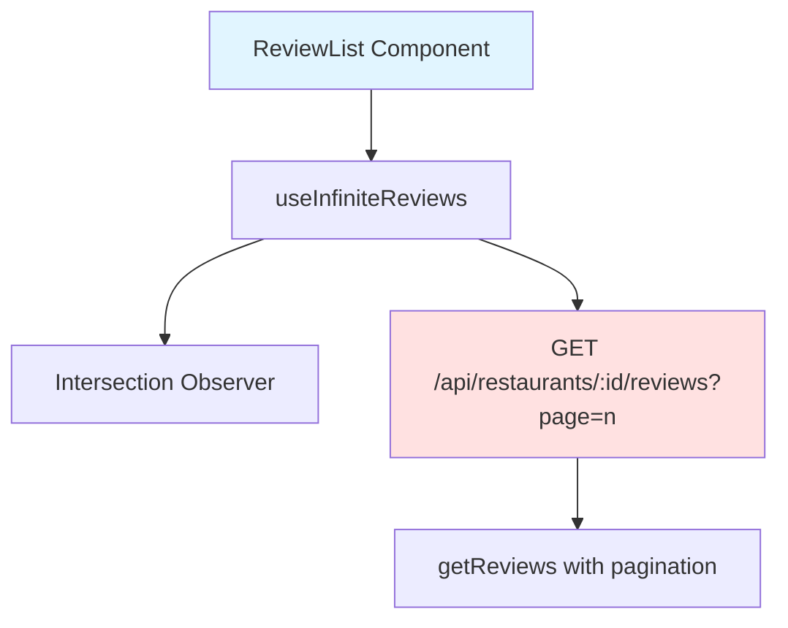

# Implementation Plan: UC-015 리뷰 목록 스크롤

## 개요

리뷰 목록의 무한 스크롤 또는 페이지네이션 기능을 구현합니다.

### 모듈 목록

| 모듈 | 위치 | 설명 |
|------|------|------|
| **useInfiniteReviews Hook** | `src/features/review/hooks/useInfiniteReviews.ts` | 무한 스크롤 React Query 훅 |
| **ReviewList Component** | `src/features/review/components/review-list.tsx` | 무한 스크롤 UI |
| **GET /api/restaurants/:id/reviews Route** | `src/features/review/backend/route.ts` | 페이지네이션 파라미터 추가 |

---

## Diagram



---

## Implementation Plan

### 1. Backend Layer

#### Route 수정: `src/features/review/backend/route.ts`

```typescript
app.get('/api/restaurants/:restaurantId/reviews', async (c) => {
  const restaurantId = c.req.param('restaurantId');
  const page = Number(c.req.query('page') ?? '1');
  const limit = Number(c.req.query('limit') ?? '10');
  const offset = (page - 1) * limit;

  const supabase = getSupabase(c);
  const result = await getReviews(supabase, restaurantId, limit, offset);

  return respond(c, result);
});
```

### 2. Frontend Layer

#### Hook: `src/features/review/hooks/useInfiniteReviews.ts`

```typescript
'use client';

import { useInfiniteQuery } from '@tanstack/react-query';
import { apiClient } from '@/lib/remote/api-client';
import { GetReviewsResponseSchema, type Review } from '@/features/review/lib/dto';

const fetchReviews = async (
  restaurantId: string,
  page: number,
): Promise<Review[]> => {
  const { data } = await apiClient.get(
    `/api/restaurants/${restaurantId}/reviews`,
    { params: { page, limit: 10 } },
  );
  return GetReviewsResponseSchema.parse(data);
};

export const useInfiniteReviews = (restaurantId: string) => {
  return useInfiniteQuery({
    queryKey: ['restaurants', restaurantId, 'reviews'],
    queryFn: ({ pageParam = 1 }) => fetchReviews(restaurantId, pageParam),
    getNextPageParam: (lastPage, allPages) => {
      return lastPage.length === 10 ? allPages.length + 1 : undefined;
    },
    initialPageParam: 1,
  });
};
```

#### Component: `src/features/review/components/review-list.tsx`

```typescript
'use client';

import { useEffect, useRef } from 'react';
import { ReviewCard } from './review-card';
import { useInfiniteReviews } from '@/features/review/hooks/useInfiniteReviews';

type ReviewListProps = {
  restaurantId: string;
};

export const ReviewList = ({ restaurantId }: ReviewListProps) => {
  const {
    data,
    fetchNextPage,
    hasNextPage,
    isFetchingNextPage,
  } = useInfiniteReviews(restaurantId);

  const observerRef = useRef<HTMLDivElement>(null);

  useEffect(() => {
    const observer = new IntersectionObserver(
      (entries) => {
        if (entries[0].isIntersecting && hasNextPage && !isFetchingNextPage) {
          fetchNextPage();
        }
      },
      { threshold: 0.5 },
    );

    if (observerRef.current) {
      observer.observe(observerRef.current);
    }

    return () => observer.disconnect();
  }, [fetchNextPage, hasNextPage, isFetchingNextPage]);

  const reviews = data?.pages.flat() ?? [];

  if (reviews.length === 0) {
    return (
      <div className="text-center text-slate-500">
        아직 리뷰가 없습니다. 첫 리뷰를 작성해보세요!
      </div>
    );
  }

  return (
    <div className="space-y-4">
      {reviews.map((review) => (
        <ReviewCard key={review.id} review={review} />
      ))}

      {/* Intersection Observer 타겟 */}
      <div ref={observerRef} className="h-10">
        {isFetchingNextPage && (
          <div className="text-center text-slate-500">로딩 중...</div>
        )}
        {!hasNextPage && reviews.length > 10 && (
          <div className="text-center text-slate-500">
            모든 리뷰를 확인했습니다
          </div>
        )}
      </div>
    </div>
  );
};
```

### 3. QA Sheet

- ✅ 스크롤 하단 도달 시 다음 페이지 로드
- ✅ 로딩 스피너 표시
- ✅ 더 이상 데이터 없을 때 메시지 표시
- ✅ 중복 요청 방지
- ✅ Intersection Observer 정리

### 4. 의존성

- **선행 작업**: UC-011
- **후속 작업**: 없음

