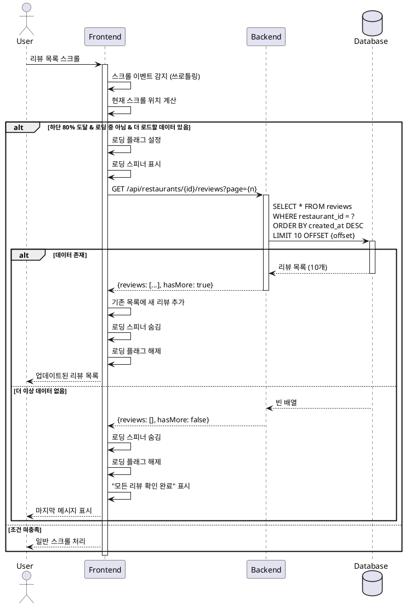

# UC-015: 리뷰 목록 스크롤

## Primary Actor
일반 사용자 (음식점의 여러 리뷰를 확인하고자 하는 사용자)

## Precondition
- 사용자가 음식점 세부 정보 페이지에 접속한 상태
- 리뷰 목록이 화면에 표시되어 있음
- 리뷰가 10개 이상 존재하여 스크롤이 필요한 상태

## Trigger
사용자가 음식점 세부 정보 페이지의 리뷰 목록 영역을 스크롤

## Main Scenario

1. 사용자가 리뷰 목록 영역을 스크롤한다
2. 시스템은 스크롤 이벤트를 감지한다
3. 시스템은 현재 스크롤 위치를 계산한다
4. **무한 스크롤 구현 시:**
   - 시스템은 스크롤이 하단에 가까워지는지 확인한다 (예: 80% 지점)
   - 하단 근접 시 다음 페이지 리뷰 데이터를 요청한다 (`GET /api/restaurants/{restaurantId}/reviews?page={n}`)
   - 로딩 스피너를 표시한다
   - 응답 데이터를 기존 목록에 추가한다
   - 로딩 스피너를 숨긴다
5. **페이지네이션 구현 시:**
   - 스크롤 동작만 처리한다
   - 추가 로직 없음
6. 사용자에게 업데이트된 리뷰 목록이 표시된다

## Edge Cases

### 더 이상 불러올 리뷰 없음
- **원인**: 모든 리뷰를 이미 로드함
- **처리**: API 응답으로 마지막 페이지 확인, 추가 요청 중단, "모든 리뷰를 확인했습니다" 메시지 표시 (선택)

### API 호출 중 추가 스크롤
- **원인**: 사용자가 로딩 중에도 계속 스크롤
- **처리**: 중복 요청 방지, 로딩 중 플래그 사용, 현재 요청 완료 후 다음 요청 처리

### 네트워크 에러
- **원인**: 인터넷 연결 끊김, API 타임아웃
- **처리**: 에러 메시지 표시, 재시도 버튼 제공, 기존 리뷰는 유지

### 빠른 스크롤
- **원인**: 사용자가 매우 빠르게 스크롤
- **처리**: 쓰로틀링 적용 (300ms), 성능 최적화, 불필요한 API 호출 방지

### 스크롤 위치 복원
- **원인**: 뒤로가기로 재진입 시 스크롤 위치 복원 필요
- **처리**: 브라우저 기본 스크롤 복원 또는 수동 위치 저장/복원

### 리뷰 개수가 적은 경우
- **원인**: 리뷰가 10개 미만으로 스크롤 불필요
- **처리**: 무한 스크롤 로직 비활성화, 모든 리뷰 한 번에 표시

## Business Rules

- BR-001: 리뷰는 최신순으로 정렬하여 표시한다
- BR-002: 초기 로드 시 10개의 리뷰를 표시한다
- BR-003: 무한 스크롤 시 한 번에 10개씩 추가 로드한다
- BR-004: 스크롤이 하단 80% 지점에 도달하면 다음 페이지를 로드한다
- BR-005: 로딩 중에는 중복 요청을 방지한다
- BR-006: 모든 리뷰 로드 완료 시 추가 요청을 중단한다

## Sequence Diagram

