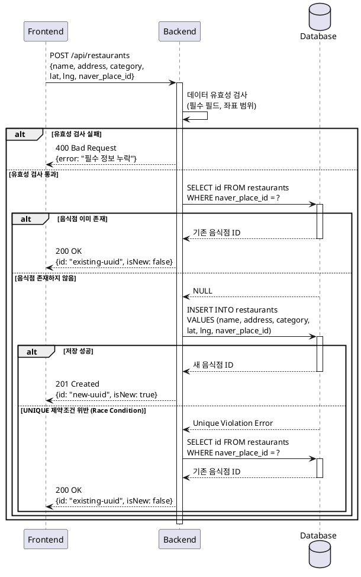

# UC-019: 음식점 정보 저장 (검색 결과에서)

## Primary Actor
시스템 (사용자의 리뷰 작성 요청에 따라 자동으로 실행)

## Precondition
- 사용자가 검색 결과 모달에서 리뷰 작성 버튼을 클릭한 상태
- 네이버 검색 API로부터 음식점 정보를 받은 상태

## Trigger
사용자가 검색 결과에서 특정 음식점의 리뷰 작성 버튼을 클릭

## Main Scenario

1. 시스템은 선택된 음식점의 네이버 플레이스 ID를 추출한다
2. 시스템은 내부 데이터베이스에서 해당 네이버 플레이스 ID로 음식점을 조회한다
3. **음식점이 존재하지 않는 경우:**
   - 시스템은 음식점 정보 저장 API를 호출한다 (`POST /api/restaurants`)
   - 요청 바디에 음식점 정보를 포함한다:
     - 음식점 이름
     - 전체 주소
     - 음식 카테고리
     - 위도
     - 경도
     - 네이버 플레이스 ID
   - 백엔드는 데이터 유효성을 검사한다
   - 백엔드는 음식점 정보를 데이터베이스에 저장한다
   - 백엔드는 생성된 음식점 ID를 반환한다
4. **음식점이 이미 존재하는 경우:**
   - 시스템은 기존 음식점 ID를 사용한다
5. 시스템은 획득한 음식점 ID를 반환한다

## Edge Cases

### 필수 정보 누락 (이름, 주소)
- **원인**: 네이버 API 응답에 필수 정보가 없음
- **처리**: 저장 실패, 사용자에게 "음식점 정보가 불완전합니다" 안내, 리뷰 작성 불가

### 중복 저장 시도 (Race Condition)
- **원인**: 동시에 여러 사용자가 같은 음식점에 대해 리뷰 작성 시도
- **처리**: 데이터베이스 UNIQUE 제약조건 (naver_place_id)으로 처리, 충돌 시 기존 레코드 조회 후 ID 반환

### 좌표 형식 오류
- **원인**: 위도/경도 값이 유효 범위를 벗어남
- **처리**: 유효성 검사 (위도 -90~90, 경도 -180~180), 오류 시 저장 실패

### 카테고리 정보 없음
- **원인**: 네이버 API 응답에 카테고리 정보 누락
- **처리**: NULL 또는 빈 문자열로 저장, 선택 필드로 처리

### 네이버 플레이스 ID 없음
- **원인**: 네이버 API 응답에 플레이스 ID 누락
- **처리**: NULL 허용 또는 임시 ID 생성, 추후 연동 개선 시 업데이트

### 데이터베이스 연결 실패
- **원인**: 데이터베이스 서버 다운, 네트워크 오류
- **처리**: 에러 로깅, 사용자에게 일시적 오류 안내, 재시도 유도

### 주소 정보 불완전
- **원인**: 주소가 너무 짧거나 형식이 이상함
- **처리**: 최소 길이 검증, 경고 로그 기록하되 저장은 진행

## Business Rules

- BR-001: 네이버 플레이스 ID를 기준으로 중복 저장을 방지한다
- BR-002: 음식점 이름과 주소는 필수 정보이며, 누락 시 저장하지 않는다
- BR-003: 좌표 정보(위도, 경도)는 유효한 범위 내에 있어야 한다
- BR-004: 음식점 카테고리는 선택 사항이며, 없을 경우 NULL로 저장한다
- BR-005: 중복 저장 시도 시 기존 레코드의 ID를 반환한다
- BR-006: 생성 일시와 수정 일시는 자동으로 기록된다

## Sequence Diagram

