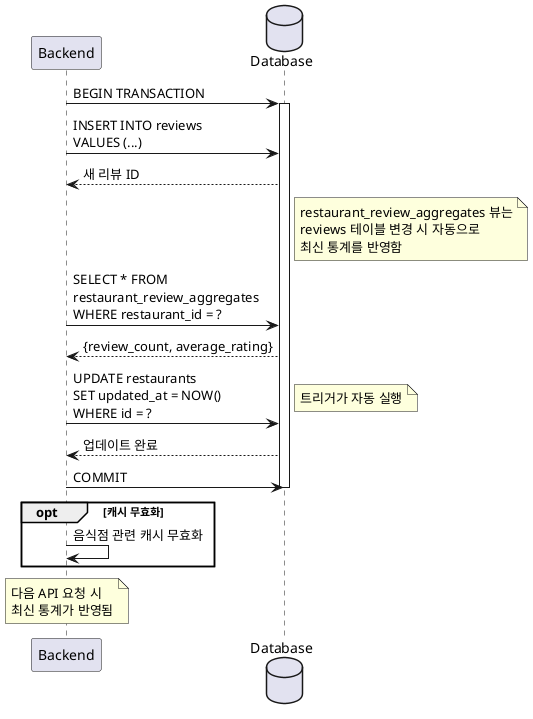

# UC-020: 리뷰 통계 업데이트

## Primary Actor
시스템 (백엔드 자동 처리)

## Precondition
- 새 리뷰가 데이터베이스에 저장된 상태
- 음식점 레코드가 존재함

## Trigger
리뷰 저장 트랜잭션이 완료된 후 자동으로 실행

## Main Scenario

1. 시스템은 리뷰 저장 트랜잭션을 완료한다
2. 시스템은 해당 음식점의 모든 리뷰를 조회한다
3. 시스템은 평균 평점을 재계산한다:
   - 총 평점 합계 / 리뷰 개수
   - 소수점 둘째 자리까지 계산, 첫째 자리로 반올림
4. 시스템은 리뷰 개수를 업데이트한다
5. 시스템은 음식점 레코드의 updated_at 타임스탬프를 갱신한다
6. 시스템은 관련 캐시를 무효화한다 (해당 음식점 관련 캐시)
7. 다음 API 요청 시 최신 통계가 반영된다

## Edge Cases

### 첫 번째 리뷰
- **원인**: 음식점에 처음으로 리뷰가 작성됨
- **처리**: 평균 평점 = 리뷰 평점, 리뷰 개수 = 1, 음식점이 지도 마커에 표시되기 시작

### 리뷰 삭제 시 (미래 기능)
- **원인**: 사용자가 리뷰를 삭제함
- **처리**: 통계 재계산 트리거, 리뷰 0개 시 평균 평점 NULL 또는 0, 마커 제거

### 동시 다발적 리뷰 작성
- **원인**: 여러 사용자가 동시에 같은 음식점에 리뷰 작성
- **처리**: 데이터베이스 트랜잭션으로 데이터 무결성 보장, Row-level Lock 처리

### 계산 오류
- **원인**: 평점 합계 계산 중 오버플로우, 나누기 오류
- **처리**: 에러 로깅, 기본값 유지 또는 다음 요청 시 재계산

### 뷰 갱신 지연
- **원인**: 데이터베이스 뷰 갱신에 시간 소요
- **처리**: Materialized View 사용 시 명시적 REFRESH, 일반 View는 자동 갱신

### 평점 범위 오류
- **원인**: 잘못된 평점 값이 저장됨 (1~5 범위 벗어남)
- **처리**: CHECK 제약조건으로 사전 방지, 계산 시 유효성 재검증

### 캐시 무효화 실패
- **원인**: 캐시 서버 연결 오류
- **처리**: 에러 로깅, 캐시 TTL로 자동 만료 대기

## Business Rules

- BR-001: 평균 평점은 소수점 첫째 자리까지 표시한다 (예: 4.3)
- BR-002: 리뷰 개수는 정수로 표시한다
- BR-003: 통계 업데이트는 리뷰 저장과 동일한 트랜잭션 내에서 처리된다
- BR-004: 음식점의 updated_at 타임스탬프는 리뷰 작성 시마다 갱신된다
- BR-005: 리뷰가 0개인 경우 평균 평점은 NULL로 표시한다
- BR-006: 통계는 데이터베이스 뷰를 통해 실시간으로 계산된다

## Sequence Diagram

