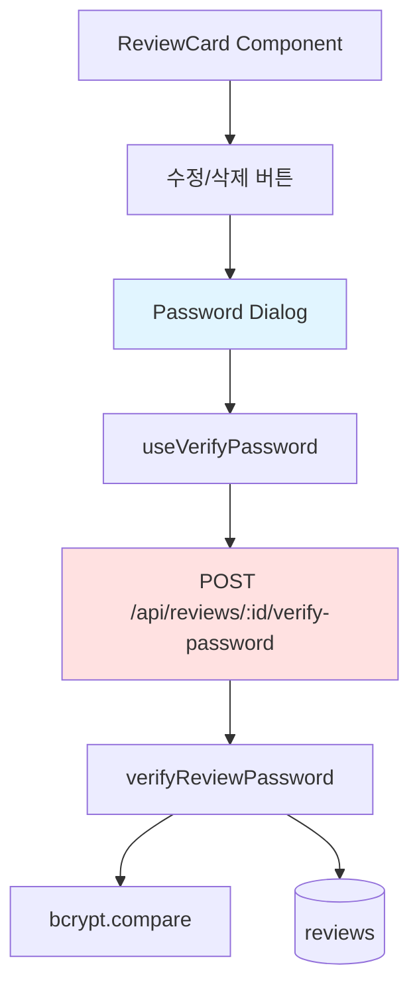

# Implementation Plan: UC-021 비밀번호 검증 (미래 기능 - 리뷰 수정/삭제)

## 개요

리뷰 수정/삭제 시 비밀번호를 검증하는 기능입니다. 현재는 미래 기능으로 구현하지 않습니다.

### 모듈 목록 (미래 구현 시)

| 모듈 | 위치 | 설명 |
|------|------|------|
| **VerifyPassword Schema** | `src/features/review/backend/schema.ts` | 비밀번호 검증 스키마 |
| **verifyReviewPassword Service** | `src/features/review/backend/service.ts` | 비밀번호 검증 로직 |
| **POST /api/reviews/:id/verify-password Route** | `src/features/review/backend/route.ts` | 비밀번호 검증 엔드포인트 |
| **useVerifyPassword Hook** | `src/features/review/hooks/useVerifyPassword.ts` | React Query mutation |
| **PasswordDialog Component** | `src/features/review/components/password-dialog.tsx` | 비밀번호 입력 다이얼로그 |

---

## Diagram



---

## Implementation Plan (미래 구현 시)

### 1. Backend Layer

#### Schema: `src/features/review/backend/schema.ts`

```typescript
export const VerifyPasswordRequestSchema = z.object({
  password: z.string().min(4),
});

export const VerifyPasswordResponseSchema = z.object({
  verified: z.boolean(),
  attemptsLeft: z.number().optional(),
});
```

#### Service: `src/features/review/backend/service.ts`

```typescript
import bcrypt from 'bcrypt';

export const verifyReviewPassword = async (
  client: SupabaseClient,
  reviewId: string,
  password: string,
): Promise<HandlerResult<VerifyPasswordResponse, ReviewServiceError>> => {
  // 리뷰 조회
  const { data: review, error } = await client
    .from('reviews')
    .select('password_hash')
    .eq('id', reviewId)
    .maybeSingle();

  if (error) {
    return failure(500, reviewErrorCodes.fetchFailed, error.message);
  }

  if (!review) {
    return failure(404, reviewErrorCodes.notFound, 'Review not found');
  }

  // 비밀번호 검증
  const isValid = await bcrypt.compare(password, review.password_hash);

  return success({
    verified: isValid,
  });
};
```

#### Route: `src/features/review/backend/route.ts`

```typescript
export const registerReviewRoutes = (app: Hono<AppEnv>) => {
  app.post('/api/reviews/:reviewId/verify-password', async (c) => {
    const reviewId = c.req.param('reviewId');
    const body = await c.req.json();
    
    const parsedBody = VerifyPasswordRequestSchema.safeParse(body);
    if (!parsedBody.success) {
      return respond(c, failure(400, 'INVALID_REQUEST', 'Invalid password'));
    }

    const supabase = getSupabase(c);
    const result = await verifyReviewPassword(
      supabase,
      reviewId,
      parsedBody.data.password,
    );

    return respond(c, result);
  });

  // 리뷰 수정 엔드포인트
  app.patch('/api/reviews/:reviewId', async (c) => {
    // 비밀번호 검증 후 수정 로직
  });

  // 리뷰 삭제 엔드포인트
  app.delete('/api/reviews/:reviewId', async (c) => {
    // 비밀번호 검증 후 삭제 로직
  });
};
```

### 2. Frontend Layer

#### Component: `src/features/review/components/password-dialog.tsx`

```typescript
'use client';

import { useState } from 'react';
import { Button } from '@/components/ui/button';
import { Input } from '@/components/ui/input';
import { Label } from '@/components/ui/label';
import {
  Dialog,
  DialogContent,
  DialogDescription,
  DialogFooter,
  DialogHeader,
  DialogTitle,
} from '@/components/ui/dialog';

type PasswordDialogProps = {
  isOpen: boolean;
  onClose: () => void;
  onVerify: (password: string) => Promise<boolean>;
  title: string;
};

export const PasswordDialog = ({
  isOpen,
  onClose,
  onVerify,
  title,
}: PasswordDialogProps) => {
  const [password, setPassword] = useState('');
  const [error, setError] = useState('');
  const [isVerifying, setIsVerifying] = useState(false);

  const handleSubmit = async () => {
    if (!password) {
      setError('비밀번호를 입력해주세요');
      return;
    }

    setIsVerifying(true);
    setError('');

    try {
      const isValid = await onVerify(password);
      if (!isValid) {
        setError('비밀번호가 일치하지 않습니다');
      }
    } catch (err) {
      setError('검증 중 오류가 발생했습니다');
    } finally {
      setIsVerifying(false);
    }
  };

  return (
    <Dialog open={isOpen} onOpenChange={onClose}>
      <DialogContent>
        <DialogHeader>
          <DialogTitle>{title}</DialogTitle>
          <DialogDescription>
            리뷰 작성 시 입력한 비밀번호를 입력해주세요
          </DialogDescription>
        </DialogHeader>

        <div className="space-y-2">
          <Label htmlFor="password">비밀번호</Label>
          <Input
            id="password"
            type="password"
            value={password}
            onChange={(e) => setPassword(e.target.value)}
            onKeyDown={(e) => e.key === 'Enter' && handleSubmit()}
          />
          {error && <p className="text-sm text-red-500">{error}</p>}
        </div>

        <DialogFooter>
          <Button variant="outline" onClick={onClose}>
            취소
          </Button>
          <Button onClick={handleSubmit} disabled={isVerifying}>
            {isVerifying ? '확인 중...' : '확인'}
          </Button>
        </DialogFooter>
      </DialogContent>
    </Dialog>
  );
};
```

#### Component 수정: `src/features/review/components/review-card.tsx`

```typescript
// 수정/삭제 버튼 추가
<div className="mt-2 flex gap-2">
  <Button
    variant="ghost"
    size="sm"
    onClick={() => setShowPasswordDialog(true)}
  >
    수정
  </Button>
  <Button
    variant="ghost"
    size="sm"
    onClick={() => setShowDeleteDialog(true)}
  >
    삭제
  </Button>
</div>

<PasswordDialog
  isOpen={showPasswordDialog}
  onClose={() => setShowPasswordDialog(false)}
  onVerify={handleVerifyPassword}
  title="리뷰 수정"
/>
```

### 3. 보안 고려사항

- **Rate Limiting**: 3회 실패 시 5분간 차단
- **IP 기반 제한**: 동일 IP에서 과도한 시도 방지
- **로깅**: 검증 시도 기록 (보안 감사)

### 4. QA Sheet

- ✅ 비밀번호 검증 성공/실패
- ✅ 연속 실패 시 차단
- ✅ 에러 메시지 표시
- ✅ 검증 후 수정/삭제 진행

### 5. 의존성

- **선행 작업**: UC-011 (리뷰 카드 표시)
- **후속 작업**: 리뷰 수정/삭제 기능 구현
- **패키지**: bcrypt (UC-009에서 이미 설치)
- **shadcn-ui**: dialog 컴포넌트 필요

---

**참고**: 이 기능은 현재 구현하지 않으며, 향후 필요 시 구현합니다.

