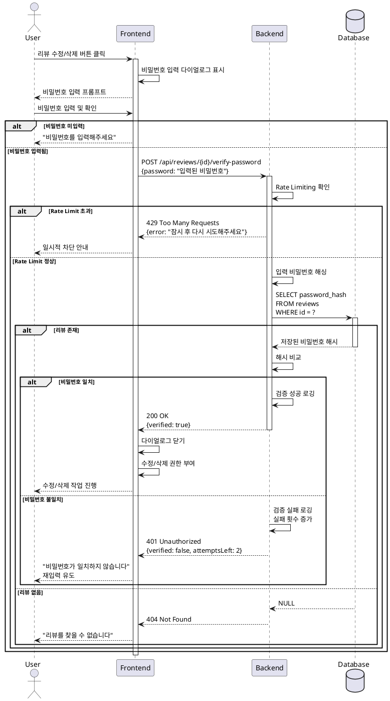

# UC-021: 비밀번호 검증 (미래 기능 - 리뷰 수정/삭제)

## Primary Actor
일반 사용자 (자신이 작성한 리뷰를 수정하거나 삭제하고자 하는 사용자)

## Precondition
- 사용자가 리뷰 상세 페이지 또는 리뷰 목록에서 수정/삭제 버튼을 클릭한 상태
- 리뷰가 데이터베이스에 존재함

## Trigger
사용자가 리뷰 수정 또는 삭제 버튼을 클릭하고 비밀번호 입력 프롬프트에 비밀번호를 입력

## Main Scenario

1. 사용자가 리뷰 수정 또는 삭제 버튼을 클릭한다
2. 시스템은 비밀번호 입력 다이얼로그를 표시한다
3. 사용자가 비밀번호를 입력하고 확인 버튼을 클릭한다
4. 시스템은 리뷰 ID와 입력된 비밀번호를 수집한다
5. 시스템은 비밀번호 검증 API를 호출한다 (`POST /api/reviews/{reviewId}/verify-password`)
6. 백엔드는 입력 비밀번호를 해싱한다
7. 백엔드는 데이터베이스에 저장된 해시와 비교한다
8. **비밀번호가 일치하는 경우:**
   - 백엔드는 성공 응답을 반환한다
   - 시스템은 수정/삭제 권한을 부여한다
   - 해당 작업(수정 또는 삭제)을 진행한다
9. **비밀번호가 일치하지 않는 경우:**
   - 백엔드는 실패 응답을 반환한다
   - 시스템은 에러 메시지를 표시한다
   - 재입력을 유도한다

## Edge Cases

### 비밀번호 미입력
- **원인**: 사용자가 비밀번호를 입력하지 않고 확인 버튼 클릭
- **처리**: 검증 실행하지 않음, 입력 요청 메시지 표시

### 연속 실패 (Brute Force 방지)
- **원인**: 악의적인 사용자가 비밀번호를 무작위로 시도
- **처리**: 3회 실패 시 일시적 차단 (5분), IP 기반 Rate Limiting

### 리뷰 존재하지 않음
- **원인**: 검증 시도 중 리뷰가 삭제됨
- **처리**: 404 에러 반환, 사용자에게 "리뷰를 찾을 수 없습니다" 안내

### 비밀번호 해싱 알고리즘 변경
- **원인**: 시스템 업그레이드로 해싱 알고리즘 변경
- **처리**: 다중 알고리즘 지원, 마이그레이션 로직, 기존 비밀번호도 검증 가능

### 네트워크 타임아웃
- **원인**: API 호출 중 네트워크 연결 끊김
- **처리**: 타임아웃 에러 표시, 재시도 버튼 제공

### 다이얼로그 취소
- **원인**: 사용자가 비밀번호 입력 다이얼로그에서 취소 버튼 클릭
- **처리**: 다이얼로그 닫기, 수정/삭제 작업 중단

### 검증 성공 후 작업 실패
- **원인**: 비밀번호는 맞지만 수정/삭제 API 호출 실패
- **처리**: 에러 메시지 표시, 재시도 옵션 제공, 비밀번호 재입력 불필요

## Business Rules

- BR-001: 비밀번호 검증은 리뷰 수정/삭제 작업 전에 필수로 수행한다
- BR-002: 비밀번호는 bcrypt 등의 안전한 해싱 알고리즘으로 비교한다
- BR-003: 3회 연속 실패 시 5분간 해당 리뷰에 대한 검증을 차단한다
- BR-004: 검증 시도는 보안 로그에 기록한다 (IP, 시간, 성공/실패)
- BR-005: 비밀번호 검증 성공 시 세션에 임시 토큰을 발급하여 재입력을 방지한다 (선택 사항)
- BR-006: Rate Limiting은 IP 기반으로 적용한다

## Sequence Diagram

